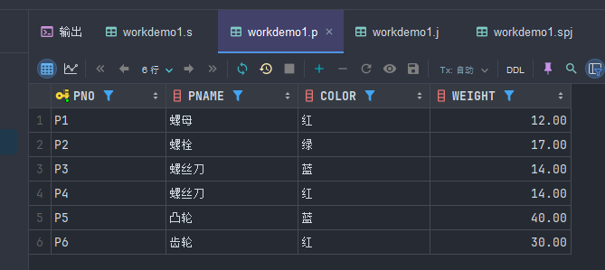
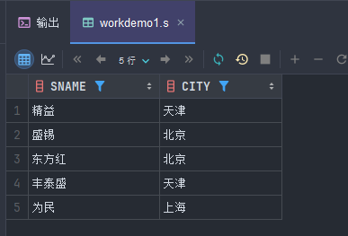
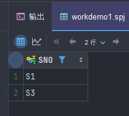
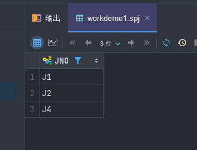

<!--
 * @Author: kerwin-win zhangjszs@foxmail.com
 * @Date: 2024-04-15 12:02:28
 * @LastEditors: kerwin-win zhangjszs@foxmail.com
 * @LastEditTime: 2024-04-15 13:21:12
 * @FilePath: \HUAT-kerwin-labwork\数据库\labwork1\work1.md
 * @Description: 这是默认设置,请设置`customMade`, 打开koroFileHeader查看配置 进行设置: https://github.com/OBKoro1/koro1FileHeader/wiki/%E9%85%8D%E7%BD%AE
-->
## 要求：
### SPJ 数据库关系模式
#### 供应商表 S
- SNO: 供应商代码
- SNAME: 供应商姓名
- STATUS: 供应商状态
- CITY: 供应商所在城市
#### 零件表 P
- PNO: 零件代码
- PNAME: 零件名
- COLOR: 颜色
- WEIGHT: 重量
##### 工程项目表 J
- JNO: 工程项目代码
- JNAME: 工程项目名
- CITY: 工程项目所在城市
#### 供应情况表 SPJ
- SNO: 供应商代码
- PNO: 零件代码
- JNO: 工程项目代码
- QTY: 供应数量
该数据库通过这四个关系模式，详细记录了供应商、零件、工程项目以及它们之间的供应关系。供应商表 S 包含了供应商的基本信息，零件表 P 描述了零件的详细信息，工程项目表 J 记录了各个工程项目的基本情况，而供应情况表 SPJ 则详细记录了供应商为工程项目提供零件的数量情况。
## 对应命令
```sql
-- 创建供应商表 S
CREATE TABLE S (
  SNO VARCHAR(10) PRIMARY KEY,
  SNAME VARCHAR(100),
  STATUS VARCHAR(50),
  CITY VARCHAR(100)
);

-- 创建零件表 P
CREATE TABLE P (
  PNO VARCHAR(10) PRIMARY KEY,
  PNAME VARCHAR(100),
  COLOR VARCHAR(50),
  WEIGHT DECIMAL(10,2)
);

-- 创建工程项目表 J
CREATE TABLE J (
  JNO VARCHAR(10) PRIMARY KEY,
  JNAME VARCHAR(100),
  CITY VARCHAR(100)
);

-- 创建供应情况表 SPJ
CREATE TABLE SPJ (
  SNO VARCHAR(10),
  PNO VARCHAR(10),
  JNO VARCHAR(10),
  QTY INT,
  PRIMARY KEY (SNO, PNO, JNO),
  FOREIGN KEY (SNO) REFERENCES S(SNO),
  FOREIGN KEY (PNO) REFERENCES P(PNO),
  FOREIGN KEY (JNO) REFERENCES J(JNO)
)
```
## 创建表


## 对应数据请见word文档
```sql
-- 插入供应商表 S 的数据
INSERT INTO S (SNO, SNAME, STATUS, CITY) VALUES
('S1', '精益', 20, '天津'),
('S2', '盛锡', 10, '北京'),
('S3', '东方红', 30, '北京'),
('S4', '丰泰盛', 20, '天津'),
('S5', '为民', 30, '上海');

--插入供应商表 S 的数据
INSERT INTO S (SNO, SNAME, STATUS, CITY) VALUES
('S1', '精益', 20, '天津'),
('S2', '盛锡', 10, '北京'),
('S3', '东方红', 30, '北京'),
('S4', '丰泰盛', 20, '天津'),
('S5', '为民', 30, '上海');

--插入零件表 P 的数据
INSERT INTO P (PNO, PNAME, COLOR, WEIGHT) VALUES
('P1', '螺母', '红', 12),
('P2', '螺栓', '绿', 17),
('P3', '螺丝刀', '蓝', 14),
('P4', '螺丝刀', '红', 14),
('P5', '凸轮', '蓝', 40),
('P6', '齿轮', '红', 30);

--插入工程项目表 J 的数据
INSERT INTO J (JNO, JNAME, CITY) VALUES
('J1', '三建', '北京'),
('J2', '一汽', '长春'),
('J3', '弹簧厂', '天津'),
('J4', '造船厂', '天津'),
('J5', '机车厂', '唐山'),
('J6', '无线电厂', '常州'),
('J7', '半导体厂', '南京');

--插入供应情况表 SPJ 的数据
INSERT INTO SPJ (SNO, PNO, JNO, QTY) VALUES
('S1', 'P1', 'J1', 200),
('S1', 'P1', 'J3', 100),
('S1', 'P1', 'J4', 700),
('S1', 'P2', 'J2', 100),
('S2', 'P3', 'J1', 400),
('S2', 'P3', 'J2', 200),
('S2', 'P3', 'J4', 500),
('S2', 'P3', 'J5', 400),
('S2', 'P5', 'J1', 400),
('S2', 'P5', 'J2', 100),
('S3', 'P1', 'J1', 200),
('S3', 'P3', 'J1', 200),
('S4', 'P5', 'J1', 100),
('S4', 'P6', 'J3', 300),
('S4', 'P6', 'J4', 200),
('S5', 'P2', 'J4', 100),
('S5', 'P3', 'J1', 200),
('S5', 'P6', 'J2', 200),
('S5', 'P6', 'J4', 500);
```
## 结果
查询语句
```sql
SELECT * FROM S;
SELECT * FROM P;
SELECT * FROM J;
SELECT * FROM SPJ;
```




## 要求
#### (1)	找出所有供应商的姓名和所在城市。
```sql
SELECT SNAME, CITY FROM S;
```


#### (2)	求供应工程J1零件P1的供应商号码SNO。
```sql
SELECT DISTINCT SN`O FROM SPJ WHERE JNO = 'J1' AND PNO = 'P1';
```

#### (3)	求供应工程J1零件为红色的供应商号码SNO。
```sql
SELECT DISTINCT SNO FROM SPJ WHERE JNO = 'J1' AND PNO IN (SELECT PNO FROM P WHERE COLOR = '红');
```

#### (4)	找出工程项目J2使用的各种零件的名称及其数量。
```sql
SELECT P.PNAME, SPJ.QTY FROM P, SPJ WHERE P.PNO = SPJ.PNO AND SPJ.JNO = 'J2';
```

#### (5)	找出使用上海产的零件的工程名称。
```sql
SELECT DISTINCT J.JNAME
FROM SPJ
JOIN J ON SPJ.JNO = J.JNO
WHERE J.CITY = '上海';
```

#### (6)	求没有使用天津供应商生产的红色零件的工程号JNO。
```sql
SELECT DISTINCT SPJ.JNO FROM SPJ
JOIN P ON SPJ.PNO = P.PNO
WHERE (SPJ.SNO, P.COLOR) NOT IN (
    SELECT SNO, COLOR FROM S, P
    WHERE CITY = '天津' AND COLOR = '红'
) AND P.COLOR = '红';
```

#### (7)	把全部红色零件的颜色改成蓝色。
```sql
UPDATE P SET COLOR = '蓝' WHERE COLOR = '红';
```
#### (8)	由S5供给J4的零件P6改为由S3供应。
```sql
UPDATE SPJ SET SNO = 'S3' WHERE SNO = 'S5' AND JNO = 'J4' AND PNO = 'P6';
```
#### (9)	从供应商关系中删除供应商号是S2的记录，并从供应情况关系中删除相应的记录。
```sql
DELETE FROM SPJ WHERE SNO = 'S2';
DELETE FROM S WHERE SNO = 'S2';
```
#### (10)	请将(S2，J6，P4，200)插入供应情况关系。
```sql
INSERT INTO SPJ (SNO, JNO, PNO, QTY) VALUES ('S2', 'J6', 'P4', 200);
```
#### 4、请为三建工程项目建立一个供应情况的视图，包括供应商代码(SNO)、零件代码(PNO)、供应数量(QTY)。(10分)
```sql
CREATE VIEW SupplyInfo AS
SELECT SPJ.SNO, SPJ.PNO, SPJ.QTY
FROM SPJ
         JOIN J ON SPJ.JNO = J.JNO
WHERE J.JNAME = '三建';
```

#### 针对该视图完成下列查询：
#### (1)	找出三建工程项目使用的各种零件代码及其数量。(5分)
```sql
SELECT PNO, SUM(QTY) AS TotalQuantity
FROM SupplyInfo
GROUP BY PNO;
```

#### (2)	找出供应商S1的供应情况。(5分)
```sql
SELECT *
FROM SupplyInfo
WHERE SNO = 'S1';
```

#### 5、在表SPJ定义索引IDX_SPJ，包括（SNO,PNO,JNO）。比较定义索引前后求供应工程J1零件P1的供应商号码SNO的区别。(10分)
1. 在定义索引之前，先执行以下查询语句来获取求供应工程 J1 零件 P1 的供应商号码 SNO：
```sql
SELECT SNO
FROM SupplyInfo
WHERE PNO = 'P1' AND JNAME = 'J1';
记录下查询结果。

```
2. 接下来，定义索引 IDX_SPJ，包括（SNO, PNO, JNO）：
```sql
CREATE INDEX IDX_SPJ ON SPJ (SNO, PNO, JNO);
```
3. 然后再次执行查询语句，获取求供应工程 J1 零件 P1 的供应商号码 SNO：
```sql
SELECT SNO
FROM SupplyInfo
WHERE PNO = 'P1' AND JNAME = 'J1';
```
比较两次查询的执行时间，通常情况下，定义了索引后的查询会有更快的执行速度，因为索引可以加快数据的查找和访问。


#2. 分别创建s、p、j和spj数据表
-- 创建 s 表
CREATE TABLE s
(
    sno    CHAR(2),
    sname  VARCHAR(10),
    status INT,
    city   VARCHAR(10)
);
-- 创建 p 表
CREATE TABLE p
(
    pno    CHAR(2),
    pname  VARCHAR(10),
    color  CHAR(1),
    weight INT
);
-- 创建 j 表
CREATE TABLE j
(
    jno   CHAR(2),
    jname VARCHAR(10),
    city  VARCHAR(10)
);
-- 创建 spj 表
CREATE TABLE spj
(
    sno CHAR(2),
    pno CHAR(2),
    jno CHAR(2),
    qty INT
);
#3. 查看s、p、j和spj数据表的详细结构
-- 查看 s 表的详细结构
DESCRIBE s;
-- 查看 p 表的详细结构
DESCRIBE p;
-- 查看 j 表的详细结构
DESCRIBE j;
-- 查看 spj 表的详细结构
DESCRIBE spj;

use demo;


#插入s表数据
INSERT INTO s (sno, sname, status, city)
VALUES ('S1', '精益', 20, '天津'),
       ('S2', '盛锡', 10, '北京'),
       ('S3', '东方红', 30, '北京'),
       ('S4', '丰泰盛', 20, '天津'),
       ('S5', '为民', 30, '上海');

#插入p表数据
INSERT INTO p (pno, pname, color, weight)
VALUES ('P1', '螺母', '红', 12),
       ('P2', '螺栓', '绿', 17),
       ('P3', '螺丝刀', '蓝', 14),
       ('P4', '螺丝刀', '红', 14),
       ('P5', '凸轮', '蓝', 40),
       ('P6', '齿轮', '红', 30);


#插入j表数据
INSERT INTO j (jno, jname, city)
VALUES ('J1', '三建', '北京'),
       ('J2', '一汽', '长春'),
       ('J3', '弹簧厂', '天津'),
       ('J4', '造船厂', '天津'),
       ('J5', '机车厂', '唐山'),
       ('J6', '无线电厂', '常州'),
       ('J7', '半导体厂', '南京');


#插入spj表数据
INSERT INTO spj (sno, pno, jno, qty)
VALUES ('S1', 'P1', 'J1', 200),
       ('S1', 'P1', 'J3', 100),
       ('S1', 'P1', 'J4', 700),
       ('S1', 'P2', 'J2', 100),
       ('S2', 'P3', 'J1', 400),
       ('S2', 'P3', 'J2', 200),
       ('S2', 'P3', 'J4', 500),
       ('S2', 'P3', 'J5', 400),
       ('S2', 'P5', 'J1', 400),
       ('S2', 'P5', 'J2', 100),
       ('S3', 'P1', 'J1', 200),
       ('S3', 'P3', 'J1', 200),
       ('S4', 'P5', 'J1', 100),
       ('S4', 'P6', 'J3', 300),
       ('S4', 'P6', 'J4', 200),
       ('S5', 'P2', 'J4', 100),
       ('S5', 'P3', 'J1', 200),
       ('S5', 'P6', 'J2', 200),
       ('S5', 'P6', 'J4', 500);


#分别查询s、p、j和spj表的所有数据
-- 显示 s 表的所有数据
SELECT *
FROM s;

-- 显示 p 表的所有数据
SELECT *
FROM p;

-- 显示 j 表的所有数据
SELECT *
FROM j;

-- 显示 spj 表的所有数据
SELECT *
FROM spj;


#代码结束


USE demo;

-- 代码开始

-- 1. 查询所有供应商的姓名和所在城市（按供应商姓名升序排列）。
SELECT sname, city
FROM s
ORDER BY sname ASC;

-- 2. 查询所有零件的名称、颜色、重量（按零件名称升序排列）。
SELECT pname, color, weight
FROM p
ORDER BY pname ASC;

-- 代码结束


USE demo;

-- 代码开始

-- 1. 查询供应工程J1零件的供应商号码(去除重复，按供应商号码升序排列)。
SELECT DISTINCT sno
FROM spj
WHERE jno = 'J1'
ORDER BY sno ASC;

-- 2. 查询供应工程J1零件P1的供应商号码（按供应商号码升序排列）。
SELECT sno
FROM spj
WHERE jno = 'J1'
  AND pno = 'P1'
ORDER BY sno ASC;

-- 3. 查询使用供应商S1所供应零件的工程号码（按工程号码升序排列）。
SELECT jno
FROM spj
WHERE sno = 'S1'
ORDER BY jno ASC;

-- 代码结束

use demo;

#代码开始

#1. 查询工程项目J2使用的各种零件的名称及其数量（按零件名称升序排列）。
select p.pname, spj.qty
from p,
     spj
where p.pno = spj.pno
  and spj.jno = 'J2'
order by p.pname;


#2. 查询上海厂商供应的所有零件号码（去除重复，按零件号码升序排列）。
SELECT spj.pno
FROM spj
WHERE spj.sno IN (SELECT s.`SNO` FROM s WHERE s.city = '上海')
GROUP BY spj.pno;


#3. 查询使用上海产的零件的工程名称（按工程名称升序排列,去除重复数据）。

SELECT j.jname
FROM j
WHERE j.jno IN (SELECT spj.jno FROM spj WHERE spj.sno IN (SELECT s.sno FROM s WHERE s.city = '上海'))
order by j.jname


#代码结束

use demo;

#代码开始

#1. 查询供应工程J1零件为红色的供应商号码（按供应商号码升序排列）。


SELECT spj.sno
FROM spj
WHERE spj.jno = 'J1'
  and spj.pno in (SELECT p.pno from p where p.color = '红');


#2. 查询没有使用天津供应商生产的红色零件的工程号码（去除重复数据，按工程号码升序排列）。
#找到天津生产的零件
SELECT DISTINCT jno
FROM spj
WHERE jno NOT IN (SELECT DISTINCT jno
                  FROM spj
                           NATURAL JOIN p
                           NATURAL JOIN s
                  WHERE city = '天津'
                    AND color = '红')
order by jno asc;


#代码结束

use demo;

#代码开始
#1. 把全部红色零件的颜色改成蓝色。
UPDATE p
SET p.color='蓝'
WHERE p.color = '红';


#2. 由S5供给J4的零件P6改为由S3供应。
UPDATE spj
SET spj.sno='S3'
WHERE spj.sno = 'S5'
  AND spj.pno = 'P6'
  and spj.jno = 'J4';

#3. 从供应商关系中删除供应商号是S2的记录，并从供应情况关系中删除相应的记录。

DELETE
FROM s
WHERE s.sno = 'S2';
DELETE
FROM spj
WHERE spj.sno = 'S2';
#4. 请将(S2，J6，P4，200)插入供应情况关系表。
INSERT INTO spj VALUE ('S2', 'P4', 'J6', 200);


#代码结束

#评测使用，不要删除下面代码
select *
from s;
select *
from p;
select *
from spj;

use demo;

#代码开始
#1. 请为“三建”工程项目建立一个供应情况的视图(v_spj)，包括供应商代码(SNO)、零件代码(PNO)、供应数量(QTY)。
CREATE VIEW v_spj(sno, pno, qty) AS
SELECT sno, pno, qty
FROM spj
WHERE jno = (SELECT jno FROM j WHERE jname = '三建');

#2. 查看视图(v_spj)信息。
desc v_spj;


#针对视图(v_spj)完成下列查询：
#(1) 查询“三建”工程项目使用的各种零件代码及其总数量(total)
#提示：利用聚合函数sum()和分组查询实现，总数量起别名total。

SELECT pno, SUM(qty) total
FROM v_spj
GROUP BY pno;

#(2) 查询供应商S1的供应情况。

sELECT sno, pno, qty
FROM v_spj
WHERE sno = 'S1';
#代码结束


use demo;

#代码开始

# 1.在spj表定义索引IDX_SPJ，包括（sno,pno,jno）。
ALTER TABLE spj
    ADD INDEX IDX_SPJ (sno, pno, jno);

# 2. 查看spj表索引定义。
SHOW INDEX FROM spj;

#代码结束