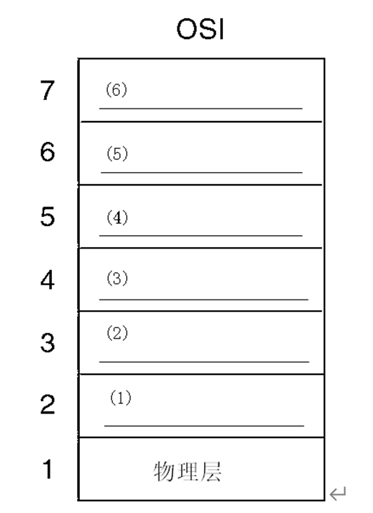
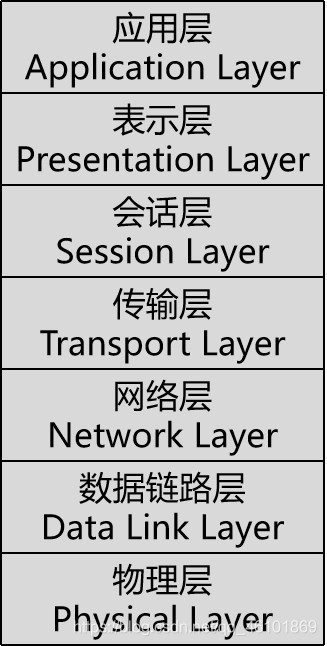
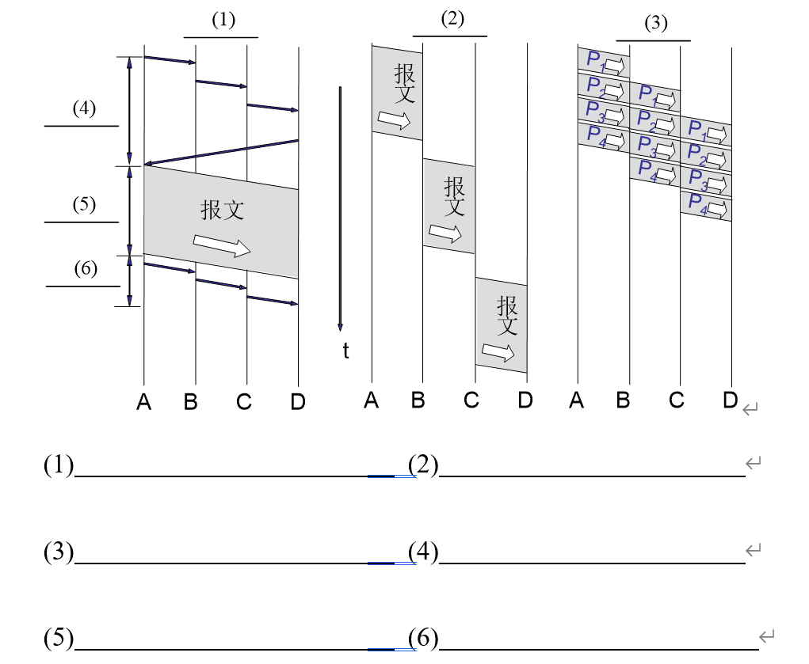
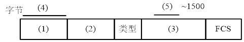
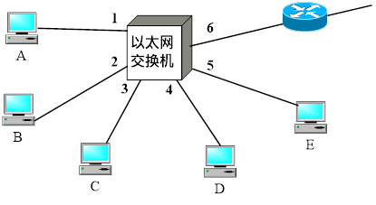
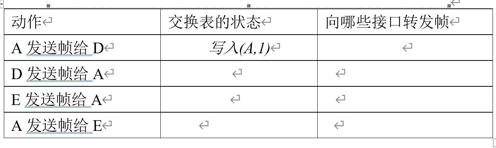
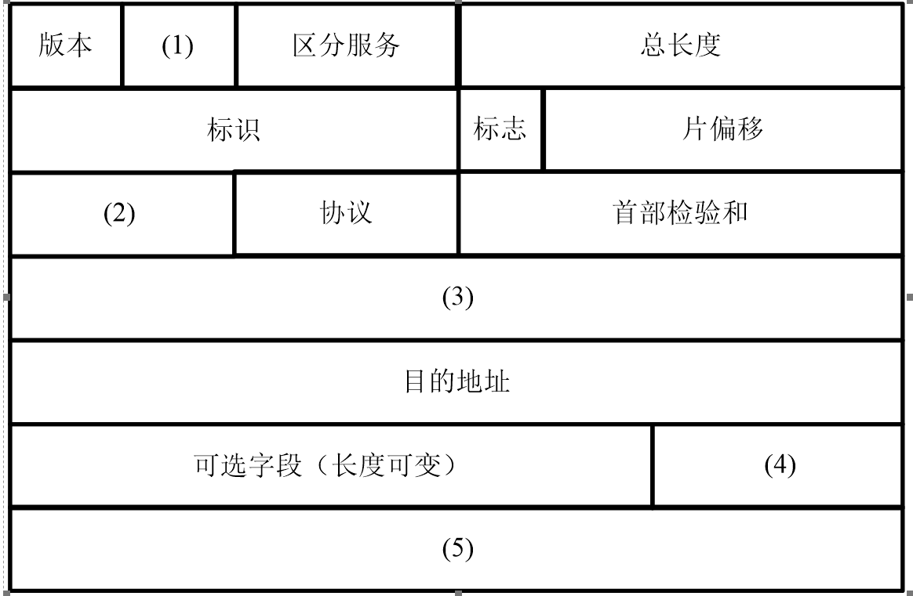
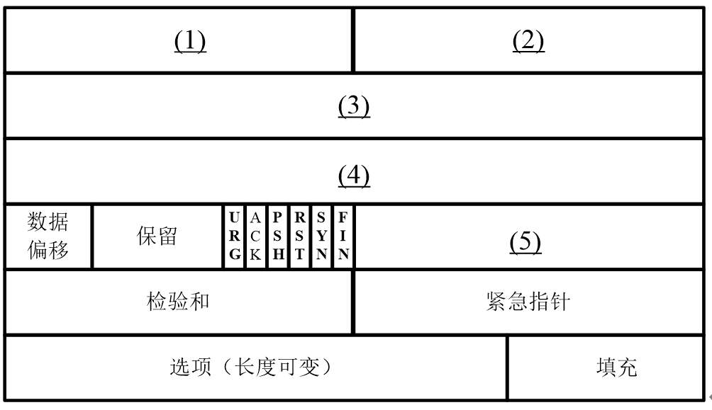
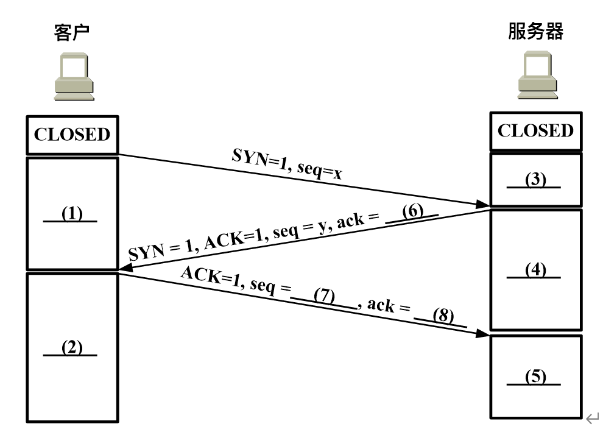
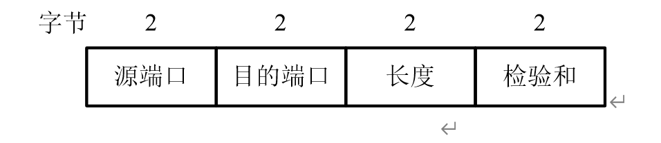

# 计算机网络复习资料

## tips
这是2024年huat，计算机科学与技术专业，计算机网络老师给出的复习大纲和习题的总结。这里是我对这些内容的总结和复习，希末能对你有所帮助。
## 第一章 概述

### 一、C/S 方式与 P2P 方式

#### C/S 方式（客户 / 服务器方式）

- 定义：服务器是提供服务的一方，通常具有强大的处理能力、大量的存储资源和稳定的网络连接。客户端则是请求服务的一方，向服务器发送请求并接收服务器的响应。例如，在 Web 浏览中，Web 服务器存储网页资源，客户端浏览器向服务器请求网页并显示。
- 特点：服务器集中管理资源和服务，安全性较高，便于维护和管理，但服务器可能成为性能瓶颈。

#### 带宽

- 定义：原指信号具有的频带宽度，单位为赫兹（Hz）。在计算机网络中，带宽通常用来表示网络通信线路所能传送数据的能力，单位为比特每秒（bit/s）。例如，一条光纤线路的带宽为 1 Gbps，表示该线路理论上每秒最多可以传输 1 千兆比特的数据。
- 与速率的关系：带宽是速率的上限，实际的传输速率通常小于等于带宽，并且受到多种因素的影响，如网络拥塞、设备性能等。

#### 吞吐量

- 定义：表示在单位时间内通过某个网络（或信道、接口）的数据量。单位也为比特每秒等。例如，一个服务器在一段时间内的平均吞吐量为 50 Mbps，表示该服务器在这段时间内平均每秒向外发送或接收 50 兆比特的数据。
- 影响因素：与网络带宽、设备处理能力、网络拥塞程度等因素密切相关，网络中的瓶颈链路往往限制了整个网络的吞吐量。

#### 时延（计算）

- 定义：数据从网络的一端传送到另一端所需的时间，包括发送时延、传播时延、处理时延和排队时延。
- 计算方法：
  - 发送时延：$$\textbf{发送时延} = \frac{\textbf{数据帧长度（比特）}}{\textbf{发送速率（比特每秒）}}$$
  例如，要发送一个 1000 比特的数据帧，发送速率为 100 Mbps，则发送时延为 10 微秒。
  - 传播时延：$$\textbf{传播时延} = \frac{\textbf{传输距离（米）}}{\textbf{信号在传输介质中的传播速度（米每秒）}}$$
  例如，在同轴电缆中信号传播速度约为 200,000,000 米每秒，若传输距离为 1000 米，则传播时延为 5 纳秒。
  - 处理时延：数据在节点进行处理（如差错检测、路由选择等）所花费的时间，其大小取决于节点的处理能力和处理算法，一般难以精确计算。
  - 排队时延：数据在节点缓存队列中等待处理和传输所花费的时间，与网络拥塞程度密切相关，在网络拥塞严重时，排队时延可能会很大。
- 总时延：$\text{总时延} = \text{发送时延} + \text{传播时延} + \text{处理时延} + \text{排队时延}$。

#### 往返时间（RTT）

- 定义：从发送方发送数据开始，到发送方收到来自接收方的确认（接收方收到数据后立即发送确认），总共经历的时间。例如，在 TCP 协议中，RTT 对于确定重传时间等参数具有重要作用。它可以通过多次测量取平均值的方法来估算，网络中的延迟和拥塞等情况会影响 RTT 的大小。

### 五、计算机网络的体系结构

#### 网络协议的定义及三要素的含义

- 定义：网络协议是为进行网络中的数据交换而建立的规则、标准或约定。
- 三要素：
  - 语法：数据与控制信息的结构或格式，例如，数据帧的格式、字段的定义等。
  - 语义：需要发出何种控制信息，完成何种动作以及做出何种响应，例如，协议规定了如何建立连接、如何进行数据传输、如何处理错误等语义规则。
  - 同步：事件实现顺序的详细说明，例如，在数据传输过程中，发送方和接收方的发送和接收顺序、何时发送确认等时间顺序上的约定。

#### 分层原理及好处

- 分层原理：将复杂的网络功能划分为多个层次，每个层次完成特定的功能，并且下层为上层提供服务，上层通过下层提供的服务来实现更复杂的功能。例如，在 TCP/IP 模型中，网络接口层负责处理与物理网络的连接，网络层负责路由选择和分组转发，传输层负责端到端的通信，应用层负责为用户提供各种网络应用服务。
- 好处：
  - 各层之间相互独立：某一层的功能实现变化不会影响其他层，便于网络的设计、实现和维护。
  - 灵活性好：可以根据需要修改或替换某一层的协议或技术，而不影响整个网络体系结构。
  - 易于实现和标准化：将复杂功能分解后，每个层次的功能相对简单，易于实现和制定标准，促进了网络技术的发展和不同网络设备之间的互联互通。

#### OSI 模型与 TCP/IP 模型的比较

- 相同点：
  - 都采用了分层的体系结构，将网络功能进行划分，便于理解和实现。
  - 都有网络层、传输层和应用层等重要层次，在这些层次上的功能有一定的相似性，如网络层都负责路由选择，传输层都提供端到端的通信服务等。

- 不同点：
  - OSI 模型有七层，分别是物理层、数据链路层、网络层、传输层、会话层、表示层和应用层；而 TCP/IP 模型通常被认为有四层，分别是网络接口层、网络层（互联网层）、传输层和应用层。
  - OSI 模型是一个理论上的模型，而 TCP/IP 模型是实际应用中的模型。
  - OSI 模型中的一些层次（如会话层和表示层）在 TCP/IP 模型中没有被明确划分，而是将这些功能合并到了应用层中。

### 六、网络层

#### 网络层服务

- 定义：网络层提供的服务允许一个主机发送数据到任何连接在互联网上的另一个主机。网络层服务包括连接less服务和连接服务。
- 连接less服务：每个分组独立路由，不需要预先建立连接，例如 IP 服务。
- 连接服务：在数据传输之前需要建立连接，例如虚拟电路服务。

#### 路由算法

- 分类：
  - 静态路由算法：路由选择不随网络状况的变化而变化，手动配置或预先设定。
  - 动态路由算法：根据网络状况的变化自动调整路由选择，例如距离矢量路由算法和链路状态路由算法。

#### IP 协议

- 定义：互联网协议（IP）是一种网络层协议，用于在互联网上路由和寻址数据包。
- 特点：
  - 无连接：IP 不维护任何关于后续数据包的状态信息。
  - 尽力交付：IP 不保证数据包的交付，也不保证数据包的顺序。
  - 分片与重组：IP 协议允许数据包在传输过程中被分片，并在目的地重新组装。

### 七、传输层

#### 传输层服务

- 定义：传输层提供端到端的数据传输服务，确保数据从一个进程传输到另一个进程。
- 服务类型：
  - 可靠的数据传输：确保数据正确无误地从发送方传输到接收方，例如 TCP 协议。
  - 不可靠的数据传输：不保证数据传输的可靠性，例如 UDP 协议。

#### TCP 协议

- 定义：传输控制协议（TCP）是一种面向连接的、可靠的、基于字节流的传输层通信协议。
- 特点：
  - 连接导向：在数据传输之前需要建立连接。
  - 可靠传输：通过序列号、确认应答、重传机制等确保数据的可靠传输。
  - 流量控制：通过滑动窗口机制控制发送方的发送速率，避免接收方处理不过来。

#### UDP 协议

- 定义：用户数据报协议（UDP）是一种无连接的、不可靠的、基于数据报的传输层协议。
- 特点：
  - 无连接：不需要建立连接，每个数据报独立传输。
  - 不可靠：不保证数据报的交付，也不保证数据报的顺序。
  - 适用于对实时性要求较高的应用，如视频会议和在线游戏。

### 八、应用层

#### 应用层协议

- 定义：应用层协议定义了运行在不同端系统上的应用程序如何相互交换数据。
- 常见协议：
  - HTTP：超文本传输协议，用于 Web 浏览器和服务器之间的通信。
  - FTP：文件传输协议，用于文件的传输。
  - SMTP：简单邮件传输协议，用于电子邮件的发送。
  - DNS：域名系统，用于将域名解析为 IP 地址。


### 九、习题

#### 填空题

1. 局域网的英文缩写为 **LAN**，广域网的英文缩写为 **WAN**。
- 解释
    - 局域网（LAN）：是指在一个相对较小的范围内，由一组计算机和网络设备互相连接而成的网络，通常用于办公室、学校、家庭等场所。
    - 广域网（WAN）：是指覆盖范围较大的网络，通常由多个局域网或城域网连接而成，例如互联网就是一个覆盖全球的广域网。
2. 无线局域网的英文缩写为 **WLAN**。
- 解释
    - 无线局域网（WLAN）：是指使用无线通信技术连接计算机和网络设备的局域网，通常使用无线路由器或接入点来提供无线网络服务。
3. 互联网分为两个部分：边缘部分和核心部分，其中，**核心部分** 由大量网络和连接这些网络的 **路由器** 组成，为 **边缘部分** 提供服务。
- 解释
    - 边缘部分：是指连接在互联网上的用户和终端设备，如计算机、手机、平板等。
    - 核心部分：是指连接在互联网上的大量网络和路由器，负责数据的传输和路由选择等功能。
4. C/S结构模式中的S表示的是 **server(或服务器)**，C/S结构模式中的C表示的是 **client(客户端)**。
- 解释
    - C/S结构模式：是指客户端和服务器之间的一种通信模式，客户端向服务器发送请求并接收服务器的响应，服务器提供服务并响应客户端的请求。
5. 计算机网络采用的通信方式包括两种：客户-服务器方式和 **对等连接** 方式（或 **P2P**）。
- 解释
    - 客户-服务器方式：是指网络中的一种通信模式，客户端向服务器发送请求并接收服务器的响应，服务器提供服务并响应客户端的请求。
    - 对等连接方式（P2P）：是指网络中的一种通信模式，各个对等实体之间具有相同的地位，可以直接通信，而不需要通过中心服务器。
6. 在对计算机网络性能进行度量时，常常需要使用多个指标，其中，**吞吐量** 表示在单位时间内通过某个网络的数据量。
- 解释
    - 吞吐量：是指在单位时间内通过某个网络（或信道、接口）的数据量，单位为比特每秒等。
7. 数据在网络中经历的时延主要由以下几个部分组成：**发送时延**、传播时延、处理时延和排队时延。
- 解释
    - 发送时延：数据从发送方发送到网络的传输介质上所需的时间。
    - 传播时延：数据在传输介质上传播的时间。
    - 处理时延：数据在节点进行处理（如差错检测、路由选择等）所花费的时间。
    - 排队时延：数据在节点缓存队列中等待处理和传输所花费的时间。
8. 在网络协议三要素中，**语法** 表示数据与控制信息的结构或格式，**语义** 表示需要发出何种控制信息，完成何种动作以及做出何种响应，**同步** 表示事件实现顺序的详细说明。
- 解释
    - 语法：数据与控制信息的结构或格式，例如，数据帧的格式、字段的定义等。
    - 语义：需要发出何种控制信息，完成何种动作以及做出何种响应，例如，协议规定了如何建立连接、如何进行数据传输、如何处理错误等语义规则。
    - 同步：事件实现顺序的详细说明，例如，在数据传输过程中，发送方和接收方的发送和接收顺序、何时发送确认等时间顺序上的约定。
9. 在层次网络体系结构中，第N层向第 **N+1** 层提供服务。
- 解释
    - 层次网络体系结构：将网络功能划分为多个层次，每个层次完成特定的功能，并且下层为上层提供服务，上层通过下层提供的服务来实现更复杂的功能。
10. 协议和服务的关系：**协议** 是水平的，是控制对等实体间通信的规则；**服务** 是垂直的，是下层向上层通过层间接口提供的。
- 解释
    - 协议：是为进行网络中的数据交换而建立的规则、标准或约定，控制对等实体间通信的规则。
    - 服务：是指网络中的一种功能，由下层向上层提供，通过层间接口提供给上层，例如网络层提供路由选择服务，传输层提供可靠传输服务等。
11. 电路交换的三个阶段为：**连接建立**、数据传送、连接释放。
- 解释
    - 电路交换：是指在通信开始之前，先建立一条专用的通信线路，然后进行数据传输，最后释放通信线路。

#### 填图题

1. 下图是OSI的七层协议体系结构，请在空格处填上相应层的名称。
<br>  

（1）数据链路层				（2）网络层
（3）运输层（或传输层）		（4）会话层
（5）表示层					（6）应用层
<br>  

2. 下图是三种交换方式的示意图，请在空格1－3处填上以下内容：报文交换、分组交换、电路交换；在空格4－6处填上以下内容：数据传送、连接建立、连接释放。
<br>  

(1) 电路交换						(2) 报文交换
(3) 分组交换						(4) 连接建立
(5) 数据传送						(6) 连接释放


#### 计算题

1. 收发两端之间的传输距离为1000km，信号在媒体上的传播速率为2×10^8 m/s。当数据长度为10^7bit，数据发送速率为100kb/s时，计算发送时延和传播时延。

发送时延：
**10^7bit / 100kb/s = 100s**

传播时延：
**1000*10^3m / (2*10^8m/s) = 5ms**
- 解释
    - 发送时延：数据从发送方发送到网络的传输介质上所需的时间。
    - 传播时延：数据在传输介质上传播的时间。


## 第二章 物理层


### 一、数据通信的基础知识

#### 单工通信
- **定义**：数据信号只能在一个方向上传输，通信双方中一方固定为发送端，另一方固定为接收端。例如，广播电台的广播信号发送，电台只负责发送信号，听众的收音机只能接收信号，数据只能从电台传向收音机，这就是典型的单工通信方式。
- **特点**：实现简单，成本较低，但通信效率相对较低，因为数据只能单向传输，缺乏交互性。

#### 半双工通信
- **定义**：数据信号可以在两个方向上传输，但不能同时进行。同一时刻，通信双方只能有一方发送数据，另一方接收数据。例如，对讲机通信，当一方按下通话按钮说话时，另一方只能收听，等说话方说完松开按钮后，另一方才能按下按钮说话。
- **特点**：相比于单工通信有了一定的交互性，设备相对简单，成本也不是很高。但由于不能同时双向传输数据，在需要频繁双向交互数据的场景下，效率会受到影响。

#### 全双工通信
- **定义**：数据信号可以同时在两个方向上进行传输。例如，常见的电话通信，双方可以同时说话和聆听，就像有两条独立的通信线路一样，能够实现高效的双向数据传输。
- **特点**：通信效率高，交互性强，适用于需要大量数据双向交互的场景，但设备相对复杂，成本较高，并且对通信线路的带宽等要求也更高。

### 二、调制方法

#### 调频（FM）
- **原理**：频率调制是使载波的瞬时频率随调制信号的变化而变化，而幅度保持不变。例如，在调频广播中，声音信号（调制信号）的高低变化会使广播电台发射的载波频率发生相应变化。如果声音信号变强，载波频率会相应升高；声音信号变弱，载波频率会相应降低。
- **应用场景**：广泛应用于广播通信领域，特别是高质量音频广播，如调频广播（FM radio），因为调频方式抗干扰能力较强，能够提供较高质量的音频传输。

#### 调幅（AM）
- **原理**：幅度调制是使载波的幅度随调制信号的变化而变化，而频率和相位保持不变。例如，早期的无线电广播很多采用调幅方式，当要传输的音频信号幅度变化时，载波的幅度也随之成比例变化。如果音频信号为正峰值，载波幅度增大；音频信号为负峰值，载波幅度减小。
- **应用场景**：在长波、中波广播等领域应用较多，因为其实现相对简单，但是抗干扰能力相对较弱，主要用于对信号质量要求不是特别高的通信场景。

#### 调相（PM）
- **原理**：相位调制是使载波的相位随调制信号的变化而变化。例如，在数字通信中，通过改变载波的相位来表示不同的数字信息，如二进制的 “0” 和 “1” 可以用不同的相位来表示。
- **应用场景**：在数字通信系统，特别是一些需要高精度相位控制的通信技术中应用广泛，如相移键控（PSK）调制技术就利用了调相原理，用于在有限的带宽内传输更多的数字信息。

### 三、传输媒体
#### 双绞线
- **结构**：由两根具有绝缘保护层的铜导线相互绞合而成。绞合的目的是为了减少相邻导线的电磁干扰。例如，常见的网线（五类线、六类线等）就是双绞线，它一般有四对双绞线，外面包裹着一层塑料外皮。
- **特点**：成本较低，安装方便，广泛应用于局域网等短距离通信。但是其传输距离相对较短，并且抗干扰能力比同轴电缆和光缆差，一般适用于 100 米以内的短距离以太网连接。

#### 同轴电缆
- **结构**：由内导体、绝缘层、外导体和护套组成。内导体是一根实心导线，外导体通常是一层金属编织网，内外导体之间用绝缘材料隔开。例如，有线电视的传输线很多采用同轴电缆，信号在内导体中传输，外导体起到屏蔽电磁干扰的作用。
- **特点**：相比双绞线，它的抗干扰能力更强，传输距离更远，带宽也相对较高。可以用于传输高频信号，如在有线电视网络和早期的计算机网络中广泛应用，但成本比双绞线高，且安装和维护相对复杂。

#### 光缆
- **结构**：主要由纤芯、包层和护套组成。纤芯是由高纯度的二氧化硅等材料制成的光导纤维，用于传输光信号，包层的折射率比纤芯低，使得光信号在纤芯中通过全反射进行传输。例如，在长距离的网络通信、高速互联网骨干网络以及跨洋通信等场景中广泛使用光缆。
- **特点**：具有极高的带宽，能够传输大量的数据，抗电磁干扰能力极强，信号衰减小，传输距离长。但是其成本较高，包括光缆本身的成本以及光纤通信设备（如光端机等）的成本，并且光纤的连接和维护需要专业的设备和技术。

### 四、信道复用技术

#### 频分复用（FDM）
- **原理**：将用于传输信道的总带宽划分成若干个子频带（子信道），每一个子频带传输一路信号。例如，在传统的广播电台中，不同的电台被分配到不同的频率段，听众通过调谐收音机到相应的频率来接收不同电台的节目，这就是频分复用的一个简单例子。
- **计算示例**：假设总带宽为 \(B\)，要复用 \(n\) 路信号，每路信号分配的带宽为 \(B_i\)，则 $$B = \sum_{i=1}^{n} B_i$$。如果总带宽为 10MHz，要复用 5 路信号，平均每路信号可分配带宽为 $$B_i = \frac{10MHz}{5} = 2MHz$$
#### 时分复用 (TDM)

* **原理**:
    将一条物理信道按时间分成若干个时间段(时隙), 轮流地分配给多个信号使用。例如, 在数字通信系统中, 不同的用户数据按照一定的时间顺序依次在信道上传输, 每个用户在自己分配的时隙内发送数据。

* **计算示例**: 
    假设一条信道的数传速率为R, 要复用n路信号, 每路信号分配的时隙为T_i, 则每路信号的传输速率为R/n。如果信道传输速率为100Mbps, 复用4路信号, 则每路信号的传输速率为100Mbps ÷ 4 = 25Mbps。

#### 统计时分复用 (STDM)

* **原理**:
    它是一种改进的时分复用技术。不像时分复用那样固定地分配时隙给各个用户, 而是根据用户的实际数据传输需求动态地分配时隙。例如, 在计算机网络的数通通信中, 当某个用户有数据要发送时, 才会分配时隙给它, 这样可以更有效地利用信道资源。

* **与时分复用的区别**:
    时分复用是固定分配, 可能会出现某些时段没有数据传输但仍然被占用的情况; 而统计时分复用通过动态分配, 提高了信道利用率, 但需要额外的控制信息来管理时隙的分配。

#### 码分复用 (CDM) (计算)

* **原理**:
    每个用户使用经过特殊挑选的不同码型来区分不同的用户信号, 这些码型相互正交, 在同一信道中可以同时传输多个用户的信号。例如, 在CDMA (码分多址) 移动通信系统中, 每个移动用户都有一个唯一的码序列, 通过将用户数据与该码序列进行调制后在同一频段发送。

* **计算示例**:
    假设码分复用系统中有n个用户, 每个用户的码片序列为C_i (i = 1, 2, ..., n), 码片序列长度为L。对于任意两个不同的码片序列C_m和C_n, 满足$$ \sum_{k=1}^{L} C_m(k) \cdot C_n(k) = 0 \quad (m \neq n) $$其中C_m(k)和C_n(k)分别表示第m个和第n个码片序列的第k个码片。如果要计算接收端如何从混合信号中提取某用户的信号, 假设接收到的混合信号为S, 要提取用户i的信号, 将S与用户i的码片序列C_i进行相关运算, 得到$$ R = \sum_{k=1}^{L} S(k) \cdot C_i(k) $$, 通过一定的判决规则就可以恢复用户i的信号。

### 五、宽带接入技术 - ADSL

####  原理
非对称数字用户线路（ADSL）是一种利用现有的电话线路实现高速数据传输的技术。它采用频分复用技术，在普通电话线上划分出不同的频段，低频部分用于传统的电话语音通信，高频部分用于数据传输。例如，语音通信占用 0 - 4kHz 的频段，而数据传输则利用更高的频段，如 25kHz - 1.1MHz 等频段，这样就可以在不影响电话正常使用的情况下提供高速上网服务。

#### 特点
- **速率不对称**：ADSL 的最大特点是下行（从网络到用户）速率和上行（从用户到网络）速率不对称，下行速率通常比上行速率高很多，这符合大多数用户的上网需求，如浏览网页、下载文件等主要是下行数据传输。
- **传输距离限制**：ADSL 的传输距离会受到限制，随着距离的增加，信号质量会下降，从而影响传输速率。
- **线路质量与信号干扰**：线路质量和信号干扰等因素会对其传输速率产生较大影响。例如，电话线路的损坏或者电磁干扰都可能导致ADSL的传输速率降低。

### 六、习题

#### 填空题

1. 从通信双方信息交互的方式来看，通信的三种基本方式为**单工**、**半双工**和**全双工**。其中，**单工**数据传输只支持数据在一个方向上传输，**全双工**数据传输则允许数据同时在两个方向上传输。
- 解释
  - **单工通信**：指数据只能沿着一个固定的方向进行传输，就像广播一样，信号只能从广播电台传向收音机，而不能反向传输。例如常见的电视广播信号传输，观众只能接收电视台发送的节目内容，无法向电视台反向传输信息。
- **全双工通信**：允许数据在两个方向上同时进行传输，就如同打电话时，双方可以同时说话、同时听到对方的声音，像我们日常使用的很多手机通话、网络语音通话等场景就是全双工通信的体现。

2. 最基本的带通调制方法包括三种：**调频**、**调幅**、和**调相**。
- 解释
  - **调频（FM）**：是使载波的瞬时频率按照所需传递信号的变化规律而变化的调制方法，常用于广播电台的调频广播等场景，其特点是抗干扰能力相对较强，声音质量较好等。
  - **调幅（AM）**：是让载波的幅度随调制信号的变化规律而变化的调制方式，在早期的无线电广播中应用较多，不过相对调频来说，抗干扰能力稍弱一些。
  - **调相（PM）**：是让载波的相位随调制信号的变化规律而变化的调制方式，常用于数字通信系统中，例如相移键控（PSK）调制技术等。

3. 对于以下信道复用技术：**时分复用**、**频分复用**、**统计时分复用**，具有动态分配时隙功能的是**统计时分复用**。

- 解释
  - **统计时分复用**：它不像传统时分复用那样固定地给每个用户分配时隙，而是根据用户的实际需求动态地分配时隙资源，这样可以更高效地利用信道资源，避免了有些用户无数据传输时时隙闲置浪费的情况，适用于数据传输量不稳定、突发情况较多的应用场景。

4. 所有用户在同样的时间占用不同的带宽资源的信道复用技术是**频分复用**，所有用户在不同的时间占用同样的频带资源的信道复用技术是**时分复用**。
- 解释
  - **频分复用（FDM）**：将整个可用的带宽划分成多个较窄的子频带，每个子频带分配给不同的用户或信号使用，各用户可以同时在各自分配的频带上进行通信，例如有线电视系统中，不同的频道使用不同的频段来传输节目内容。
  - **时分复用（TDM）**：把时间划分为等长的时隙，不同用户按照固定的顺序轮流占用这些时隙来传输数据，就好像大家轮流使用同一个通道一样，比如在一些早期的数字电话系统中会采用时分复用的方式来实现多路通话在同一条线路上传输。

5. 对于以下信道复用技术：**时分复用**、**频分复用**、**码分多址 CDMA**，**码分多址 CDMA**可以使所有用户在同样的时间使用同样的频带进行通信而不会互相干扰。
- 解释
  - **码分多址 CDMA**：它通过给每个用户分配独特的编码序列，各个用户利用这些编码序列对自己要发送的数据进行编码，在接收端再通过相应的解码操作来还原数据，即使所有用户在同一时间使用相同的频带通信，由于编码不同，也可以区分出各自的数据，常用于移动通信等领域，像我们的手机通信网络很多都应用了 CDMA 技术及其相关衍生技术来实现多用户同时通信。


## 第三章 数据链路层

### 一、透明传输（字节填充）

### 定义
- 在数据链路层进行数据传输时，为了避免数据中的某些特殊字符被误当作控制字符，从而影响数据的正确传输，采用字节填充的方法来实现透明传输。也就是将数据中出现的与帧定界符等控制字符相同的内容进行特殊处理，使得接收端可以准确还原出原始发送的数据，就好像数据可以 “透明” 地通过链路传输一样，不会因这些特殊字符而出现误解。
### 工作原理
- 当发送端的数据中出现和帧开始、结束等定界符相同的字符时，会在这个字符前面插入一个转义字符（比如在以太网中常用 “ESC” 字符作为转义字符），来对其进行标识，让接收端知道这不是真正的定界符，而是数据内容的一部分。而在接收端收到数据后，遇到转义字符，就会把紧跟其后的字符还原为原始数据中的内容，去除转义字符的特殊标识作用，从而正确地把接收到的数据还原成发送端原本要发送的样子。例如，如果帧定界符是 “FLAG”，数据中出现了 “FLAG” 字符，发送端就会把它变成 “ESC FLAG” 进行发送，接收端收到后识别 “ESC”，就知道后面的 “FLAG” 是数据内容，进而还原出正确数据。

### 二、循环冗余检验 CRC（计算）

### 定义
- 循环冗余检验是一种差错检测技术，它通过在发送的数据后面添加冗余码（也叫校验码）来检测数据在传输过程中是否出现差错。发送方利用特定的生成多项式对要发送的数据进行计算，得出冗余码并添加到数据后面一起发送，接收方收到数据后用同样的生成多项式进行校验计算，如果计算结果与接收到的冗余码一致，则大概率认为数据传输正确，反之则说明数据出现了差错。
### 工作原理
- CRC 的计算过程是通过对数据进行多项式除法运算来生成冗余码。发送方首先选择一个生成多项式，然后将数据按照该多项式进行除法运算，得到余数作为冗余码，将冗余码添加到数据后面一起发送。接收方收到数据后，也用同样的生成多项式对数据进行除法运算，如果余数为 0，则认为数据传输正确，否则认为数据出现了差错。CRC 的优点是能够检测多种差错，如单比特差错、多比特差错、奇偶错等，且计算简单、效率高，被广泛应用于数据链路层的差错检测。
### 相关概念 
#### 1. 生成多项式
- 生成多项式是 CRC 计算的关键，它决定了 CRC 的检错能力和效率。常见的生成多项式有多项式系数表示法和二进制表示法两种，其中二进制表示法更为常用。例如，CRC-32 的生成多项式为 0x04C11DB7，表示为二进制为 100110000010001110110110011。除数11011（poly值为0x1b）的二项式为$$G(X)=x^{4} +x^{3} +x^{1} +1$$，X的指数就代表了该bit位上的数据为1,（最低位为0）。 
#### 2. 多项式简记法
-  通过对CRC的基本了解我们知道，多项式的首尾必定为1，而这个1的位置在下一步计算一定为0，所以就把前面这个1给省略掉了，出现了一个叫简记式的东西，如上例中除数11011的简记式为1011，很多看过CRC高级语言源码的人会知道，对于CRC_16标准下$$G(X)=X^{16}+X^{15}+X^{2}+1$$（16#18005）的poly值实际上是8005，这里使用的就是简记式。后面会对这个用法做一个说明。
#### 3.数据宽度
-   数据宽度指的就是CRC校验码的长度（二进制位数），知道了CRC的运算概念和多项式，就可以理解这个概念了，CRC长度始终要比除数位数少1，与简记式长度是一致的。
#### 4、初始值与结果异或值
- 在一些标准中，规定了初始值，则数据在进行上述二项式运算之前，需要先将要计算的数据与初始值的最低字节进行异或，然后再与多项式进行计算。而在结果异或值不为零的情况下，则需要将计算得到的CRC结果值再与结果异或值进行一次异或计算，得到的最终值才是我们需要的CRC校验码。这里可以看出，初始值与结果值的位数要求与数据宽度一致。
#### 5、输入值反转与输出值反转
-  输入值反转的意思是在计算之前先将二项式反转，然后再用得到的新值和数据进行计算。如对于$$G(X)=X^{16}+X^{15}+X^{2}+1$$（16#18005），其正向值为1 1000 0000 0000 0101，反转值则为1010 0000 0000 0001 1输出值反转则是将最终得到的CRC结果反转。通常，输入值反转后的结果值也会是反转的，所以这两个选项一般是同向的，我们只有在在线CRC计算器中会看到自由选择正反转的情况存在。
#### 6.异或
- 异或运算是一种常见的逻辑运算，其运算规则是：两个操作数的每一位进行比较，如果相同则结果为0，不同则结果为1。异或运算常用于数据的校验和计算、数据加密等场景中。例如，对于两个二进制数 1010 和 1100 进行异或运算，结果为 0110。
```
0^0 = 0
0^1 = 1
1^1 = 0
1^0 = 1
```
- 异或运算存在如下几个规律，需要了解。
```
1. 任何数和0异或，结果仍然是原来的数，即 A^0 = A。
2. 任何数和自己异或，结果是0，即 A^A = 0。
3. 异或运算满足交换律和结合律，即 A^B = B^A，(A^B)^C = A^(B^C)。
4. 即1异或任何数等于任何数取反，即 A^1 = ~A。
5. 何数与自己异或，结果为0,即A^A = 0。
```
##### 7.模2加法 模2减法 模2除法
- 模2加法是指在二进制数的加法运算中，不考虑进位，只考虑每一位的相加结果，即 1+1=0，1+0=1，0+0=0。模2减法和模2加法类似，只是将减法运算转换为加法运算，即 A-B = A+(-B)。模2除法是指在二进制数的除法运算中，不考虑进位，只考虑每一位的相除结果，即 1/1=1，1/0=1，0/0=0。
### 计算步骤
 - 例题 在数据通信过程中，用CRC方法校验信息，取$P(X)=x^{3} +x^{2} +1$。若发送方需要发送的数据信息为101001，试求发送的帧。要求写出计算过程。
- 解答
  - 1. 数据信息：101001
  - 2. 生成多项式：P(X) = X3 + X2 + 1 除数为 1101
  - 3. 计算帧的步骤如下：
    - 3.1. 在数据信息后面添加 3 个 0，作为 CRC 校验码的初始值，得到 101001000。
    - 3.2. 用生成多项式 P(X) 对 101001000 进行除法运算，得到余数 001。
    - 3.3. 将余数 001 作为 CRC 校验码添加到数据信息后面，得到发送的帧为 101001001。
  - 4. 计算过程如下：


### 三、局域网按拓扑结构分类

### 星型拓扑
- 结构特点：以一个中心节点（如集线器或交换机）为核心，其他各个节点（如计算机等终端设备）都通过单独的线路连接到这个中心节点上，就像星星的形状一样，中心节点处于核心位置，各分支向外辐射。
- 优点：易于实现集中管理和控制，一个节点出现故障一般不会影响其他节点之间的通信（只要中心节点正常），便于故障排查和维护，添加或移除节点也相对方便，只需要在中心节点处进行相应的线路连接或断开操作就行。
- 缺点：对中心节点的依赖性过强，如果中心节点出现故障，整个网络就会瘫痪，并且随着节点数量增多，需要的线缆数量也会大量增加，布线成本会变高。
### 环形网
- 结构特点：各个节点通过通信线路依次首尾相连，形成一个闭合的环形，数据在环中沿着一个固定方向（比如顺时针或逆时针）循环传输，每个节点都可以接收和转发数据，从一个节点发送的数据会依次经过环上的其他节点，最终回到发送节点。
- 优点：结构比较简单，信道利用率相对较高，因为数据在环上不断循环传输，只要节点空闲就可以利用信道传输数据，而且网络的实时性较好，适合对实时性要求较高的一些应用场景，如工业控制领域中的部分实时监测系统等。
- 缺点：可靠性较差，任何一个节点或者链路出现故障，整个环网就可能无法正常工作，因为数据传输的环路被破坏了；并且网络扩充不太方便，要添加新节点时需要打断环网的链路进行重新连接等操作，比较复杂。
### 总线网
- 结构特点：所有节点都连接到一条共享的总线上，这条总线一般是同轴电缆等传输介质，各个节点通过相应的接口连接到总线上，数据在总线上以广播的形式进行传输，任何一个节点发送的数据，总线上的其他节点都能接收到，然后根据数据中的目的地址等信息来判断是否接收该数据。
- 优点：结构简单，布线容易，成本较低，所需要的线缆等硬件资源相对较少，易于进行网络的扩展，只要在总线上增加节点的连接接口就行，不需要像星形网那样复杂的布线，也不像环形网那样打断链路去添加节点。
- 缺点：同一时刻只能有一个节点发送数据，否则就会出现冲突，导致数据传输失败，所以需要采用一些冲突避免或者解决的机制（如 CSMA/CD 协议），而且总线的故障会影响整个网络，一旦总线出现问题，所有节点都无法正常通信了。
### 树形网
- 结构特点：是一种分层结构的网络拓扑，有一个根节点，然后从根节点向下延伸出多个分支，每个分支又可以再细分出子分支等，节点按照层次关系连接，就像树的形状一样，越往下节点数量可能越多，它综合了星形网和总线网的一些特点。
- 优点：易于扩展，可以方便地在各个层次添加新的节点来扩充网络规模，同时它也具有一定的层次化管理优势，便于进行网络资源的分配和管理等操作，而且相比环形网等在一定程度上可靠性有所提高，因为某一个分支出现故障不一定会影响整个网络的所有部分。
- 缺点：对根节点的依赖性较强，如果根节点出现故障，可能会影响到其下众多分支节点的通信，而且网络的维护和配置相对复杂一些，需要考虑不同层次节点之间的关系和通信规则等。

### 四、CSMA/CD 协议
#### 工作原理
- 载波监听：网络中的各个节点在发送数据之前，会先监听信道（也就是传输介质，如电缆等），看信道上是否有其他节点正在发送数据。这就好比大家在使用公共广播系统讲话前，先听听有没有别人正在说话一样，如果监听到信道空闲，就可以准备发送数据；如果监听到信道忙，即有其他节点正在发送数据，那就需要等待，直到信道空闲为止。
- 冲突检测：即使节点在发送数据前监听到信道空闲并开始发送了，但由于网络中存在传播延迟等因素，有可能在发送数据的同时，其他节点也刚好开始发送数据了，这样就会导致数据在信道上发生冲突（就像两个人同时对着广播讲话，声音就会混杂在一起，听不清了）。所以在发送数据过程中，节点还需要不断检测是否发生了冲突。常用的检测方法比如通过比较发送的数据信号和接收到的信号，如果两者不一致，就说明发生了冲突。
- 冲突处理：一旦检测到冲突发生，发送数据的节点会立即停止发送当前的数据帧，并且会发送一个阻塞信号（用来告知其他节点发生了冲突，让它们也停止发送），然后等待一段随机时间后，再重新尝试发送数据，这个随机时间是按照一定的退避算法来确定的，目的是尽量避免再次发生冲突。
#### 最短帧长（计算）
- 原理：为了确保在数据帧传输的过程中，能够及时检测到是否发生了冲突，就规定了最短帧长。如果帧长过短，可能在冲突还没来得及被检测到的时候，数据帧就已经发送完了，那就无法准确判断是否有冲突了。最短帧长的计算和网络的数据传输速率以及网络的最大传播时延等因素有关。
- 计算方法：最短帧长 = $$L_{min} = \frac{2 \times R \times d}{v}$$其中**R**是网络的数据传输速率（单位一般是 bit/s），**d**是网络的最大传播时延（单位一般是 s），**v**是信号在传输介质中的传播速度（单位一般是 m/s）。例如，如果网络的数据传输速率为 10Mbps，最大传播时延为 10μs，信号传播速度为 2×10^8 m/s，那么最短帧长就是 $$L_{min} = \frac{2 \times 10\times 10^6 \times 2000}{2 \times 10^8} = 200bit$$。

### 五、MAC 地址
#### 组成
- 定义：MAC 地址（Media Access Control Address）也叫物理地址或硬件地址，是用来标识网络接口卡（NIC，也就是网卡）的一个全球唯一的标识符。
- 格式：MAC 地址长度为 48 位（6 个字节），通常用十六进制表示，比如 “00-11-22-33-44-55” 这样的形式。它分为两部分，前 24 位（3 个字节）由 IEEE（电气和电子工程师协会）的注册管理机构分配给不同的网络设备制造商，用于标识制造商，这部分也叫组织唯一标识符（OUI）；后 24 位（3 个字节）则由制造商自行分配，用于标识其生产的具体网络接口卡，也就是同一制造商生产的不同网卡在后 24 位会有区别。
#### MAC 帧格式
- 帧头部分：包含了目的 MAC 地址和源 MAC 地址字段，目的 MAC 地址指明了这个帧要发送到哪个网卡对应的设备上，源 MAC 地址则标识了发送这个帧的网卡所在的设备，这样接收端就能根据目的 MAC 地址判断是否接收该帧，同时也能知道是谁发送的。另外，帧头中还有一些控制字段，用于控制帧的传输等操作，比如指示帧的类型等。
- 数据部分：这是真正要传输的数据内容，其长度可以根据实际情况有所不同，但要受到一定的限制，不同的网络协议规定了不同的数据长度范围，比如以太网中就有最大传输单元（MTU）的限制。
- 帧尾部分：一般包含了用于差错检测的字段，比如采用 CRC 校验等方式生成的校验码，接收端可以通过对这个校验码的验证来判断帧在传输过程中是否出现了差错，确保数据的准确性。
### 六、网桥
#### 工作原理
- 学习功能：网桥刚接入网络时，它的转发表是空的。当有数据帧在网络中传输经过网桥时，网桥会查看数据帧中的源 MAC 地址，并记录下该 MAC 地址对应的端口（也就是这个数据帧是从哪个端口进入网桥的），将其添加到自己的转发表中，这样经过一段时间的学习，网桥就能知道各个 MAC 地址对应的端口位置了。
- 转发功能：当网桥收到一个数据帧时，它会查看数据帧中的目的 MAC 地址，然后在自己的转发表中查找对应的端口。如果找到了对应的端口，并且该端口不是数据帧进入网桥的那个端口（也就是不是源端口），那么网桥就会把这个数据帧从找到的对应端口转发出去；如果在转发表中找不到目的 MAC 地址对应的端口，那么网桥会采用广播的方式，把这个数据帧从除了源端口之外的所有其他端口转发出去，希望能找到对应的接收设备。
- 过滤功能：如果数据帧的目的 MAC 地址对应的端口就是数据帧进入网桥的那个端口，说明这个数据帧不需要再转发了，网桥就会直接把这个数据帧过滤掉，不让它继续在网络中传播，这样可以减少不必要的数据传输，提高网络效率。

### 七、交换机

#### VLAN 工作原理
划分 VLAN 的目的：VLAN（Virtual Local Area Network）即虚拟局域网，是为了在物理网络的基础上，通过逻辑划分的方式，将一个局域网划分成多个不同的虚拟网络，使得不同 VLAN 内的设备之间在二层（数据链路层）上不能直接通信，就好像它们处于不同的物理局域网一样，这样可以增强网络的安全性、便于网络管理、优化网络性能等。
#### 基于端口的 VLAN 划分方式（常用方式）：
网络管理员可以根据交换机的端口来划分 VLAN，比如把交换机的 1 - 10 号端口划分到 VLAN1，11 - 20 号端口划分到 VLAN2 等等。当一个设备连接到某个端口后，它就属于对应的 VLAN 了。在这种划分方式下，交换机根据端口来判断收到的数据帧是属于哪个 VLAN 的，然后按照相应的规则进行转发。
#### VLAN 间通信原理：
由于不同 VLAN 内的设备在二层不能直接通信，所以如果要实现 VLAN 间通信，通常需要借助三层设备（如路由器）来进行转发。交换机可以通过配置中继端口（比如 802.1Q 中继端口），将不同 VLAN 的数据帧打上标签（标签中包含 VLAN 的标识信息），然后发送给路由器，路由器根据这些标签信息来识别不同 VLAN 的数据帧，并进行相应的路由转发，使得不同 VLAN 之间可以实现通信。例如，VLAN1 中的设备要和 VLAN2 中的设备通信，数据帧先经过交换机打上对应的 VLAN 标签，然后由交换机转发给路由器，路由器再进行跨 VLAN 的转发操作，最终将数据帧送到目的 VLAN 中的目的设备上。

### 八、习题

#### 填空题

1. 数据链路层必须解决的三个基本问题是封装成帧、**透明传输**和差错检测。
- 解释
    - 透明传输：指的是在数据传输过程中，数据链路层对数据中的特殊字符进行处理，确保这些字符不会影响数据的正确传输，使得接收端能够准确地还原出原始数据。

2. IEEE802.3标准的以太网的物理地址长度为**48位**。
- 解释
    - 48位：指的是以太网中每个设备的物理地址（MAC地址）长度为48位（6个字节），这是全球唯一的标识符，用于在网络中识别设备。

3. 在CSMA/CD协议中，CS、MA、CD的中文含义分别是：**载波监听**、**多点接入**、**碰撞检测**。
- 解释
    - 载波监听（CS）：指网络设备在发送数据前先监听网络是否空闲。
    - 多点接入（MA）：指多个设备可以连接到同一条通信介质上。
    - 碰撞检测（CD）：指设备在发送数据时检测到碰撞（多个设备同时发送数据）后采取的停止发送和延迟重发的措施。

4. 虚拟局域网的英文缩写是**VLAN**。
- 解释
    - VLAN：指的是虚拟局域网，它通过逻辑方式将物理上分散的网络设备划分为不同的逻辑网络，从而实现更灵活的网络管理和配置。

5. 集线器工作在**物理**层，网桥工作在**数据链路**层。
- 解释
    - 物理：集线器在物理层工作，主要负责信号的放大和转发。
    - 数据链路：网桥在数据链路层工作，能够根据MAC地址过滤和转发数据帧，实现不同网络段之间的通信。
#### 简答题

1. 采用CSMA/CD协议的以太网，其通信工作在半双工方式还是全双工方式下？请解释原因。
- 答案：在使用CSMA/CD协议时，其通信工作方式为半双工方式。
- 解释：在总线模式下，如果两个站同时发送，则会产生冲突。因此，一个站不可能同时进行发送和接收，只能在工作时进行双向交替通信，即半双工方式。这种工作方式允许设备在发送数据的同时监听总线，以便在检测到碰撞时立即停止发送并采取相应的措施。
#### 填图题

1. 下图是MAC帧格式。请在空格1-3处填上相应的字段名，在空格4和5处填上字段的大小。
 <br>
             
（1）目的地址			（2）源地址	
（3）数据				（4）6			
（5）46			
2. 在下图中，以太网交换机有6个接口，分别接到5台主机和一个路由器。在下表中的“动作”一栏中，表示先后发送了4个帧。假定在开始时，以太网交换机的交换表是空的。表中第1项已填入，请把该表中其他的栏目补充完整。
<br>

| 动作         | 交换表的状态       | 向哪些接口转发帧 |
|------------|-----------------|-------------|
| A发送帧给D   | 写入(A,1)        | 所有的接口     |
| D发送帧给A   | 写入(D,4)        | 1           |
| E发送帧给A   | 写入(E,5)        | 1           |
| A发送帧给E   | (A,1)、(D,4)、(E,5) | 5           |
- 动作 "A发送帧给D" 后，交换机学习到A主机的MAC地址与接口1的关联，因此写入(A,1)到交换表，并向所有接口转发帧，因为交换表是空的，它不知道D主机的位置。
- 动作 "D发送帧给A" 后，交换机学习到D主机的MAC地址与接口4的关联，因此写入(D,4)到交换表，并只向接口1转发帧，因为交换表已经记录了A主机的位置。
- 动作 "E发送帧给A" 后，交换机学习到E主机的MAC地址与接口5的关联，因此写入(E,5)到交换表，并只向接口1转发帧，因为交换表已经记录了A主机的位置。
- 动作 "A发送帧给E" 后，交换表的状态不变，因为A主机的位置已经记录，直接向接口5转发帧，因为交换表已经记录了E主机的位置。
#### 计算题

1. 对于1km长的CSMA/CD网络，信号传播速率为200000km/s。如果最短帧长为5000bit，求该CSMA/CD网络的数据率。

- 单程传播时延：$1 / 200000 = 5 × 10^{-6}$秒
- 往返时延为：$2 × 5 × 10^{-6}$秒 = $10^{-5}$秒
- 因为：往返时延 * 数据率 = 最短帧长
- 所以：数据率 = 最短帧长 / 往返时延 = $5000bit / 10^{-5}秒 = 5 × 10^{8}bps$。

2. 在数据链路层中，透明传输数据帧的一个方法是采用字节填充。如下是相关字符的定义，A: 01000111; B: 11100011; SOH: 00000001; EOT: 00000100; ESC: 11100000，其中SOH为帧开始符，EOT为帧结束符。如果传输的帧内容是: A B ESC ESC SOH EOT，请给出实际传输的二进制序列。

- 传输的帧内容：A B ESC ESC SOH EOT
- 经填充后，实际传输的帧为：SOH A B ESC ESC ESC ESC ESC SOH ESC EOT EOT
- 转换成二进制序列：
  - SOH: 00000001
  - A: 01000111
  - B: 11100011
  - ESC: 11100000
  - ESC: 11100000
  - ESC: 11100000
  - ESC: 11100000
  - SOH: 00000001
  - ESC: 11100000
  - EOT: 00000100
  - EOT: 00000100

因此，实际传输的二进制序列为：
00000001 01000111 11100011 11100000 11100000 11100000 11100000 11100000 00000001 11100000 00000100 00000100

## 第四章 网络层
### 一、IP 地址：A 类 - E 类范围
#### A 类 IP 地址
- 范围：A 类 IP 地址的网络号占 1 个字节（8 位），且最高位固定为 0，主机号占 3 个字节（24 位）。其地址范围是从 0.0.0.0（全 0 网络号通常有特殊用途，不作为普通分配使用）到 127.255.255.255（其中 127.0.0.0 网段保留用于本地回环测试，主要是 127.0.0.1 常被用于本机测试通信），可用的 A 类网络号范围是 1 - 126，总共 126 个 A 类网络，每个 A 类网络可容纳的主机数量非常庞大，最多可有  台主机（减去 2 是因为全 0 和全 1 的主机号有特殊用途，不能分配给普通主机）。
- 特点：适用于大型网络，网络数量相对较少，但每个网络中可容纳的主机数极多，一般用于大型企业、机构等构建超大规模的内部网络等场景。
#### B 类 IP 地址
- 范围：B 类 IP 地址的网络号占 2 个字节（16 位），其最高两位固定为 10，主机号占 2 个字节（16 位）。范围是从 128.0.0.0 到 191.255.255.255，可用的 B 类网络数量有  个（因为网络号的前两位固定，实际可变的网络号位有 14 位），每个 B 类网络可容纳的主机数量为  台主机（同样减去全 0 和全 1 的特殊主机号情况）。
- 特点：适合中等规模的网络，比 A 类网络数量多一些，每个网络可容纳的主机数量适中，常用于中等规模的企业、校园网等网络环境。
#### C 类 IP 地址
- 范围：C 类 IP 地址的网络号占 3 个字节（24 位），最高三位固定为 110，主机号占 1 个字节（8 位）。其范围是从 192.0.0.0 到 223.255.255.255，可用的 C 类网络数量为  个（网络号有 21 位可变），每个 C 类网络能容纳的主机数量为  台主机，也就是最多 254 台主机。
- 特点：适用于小型网络，网络数量众多，但每个网络中的主机数量有限，常被用于小型办公室、家庭网络等场景。
#### D 类 IP 地址
- 范围：D 类 IP 地址的最高四位固定为 1110，其范围是从 224.0.0.0 到 239.255.255.255，这类地址主要用于多播（组播）通信，并不用于标识网络中的主机等常规用途，而是用来作为多播组的标识符，一个多播组内的多个主机可以接收发往该多播地址的数据。
- 特点：专门服务于多播应用场景，比如在线视频直播等，当主播向某个多播地址发送视频流时，加入该多播组的多个用户就能同时接收到视频内容。
#### E 类 IP 地址
- 范围：E 类 IP 地址的最高五位固定为 11110，范围是从 240.0.0.0 到 255.255.255.255，这类地址目前是保留地址，暂未用于常规的网络通信分配等用途，主要是为未来的一些特殊网络应用等预留的地址空间。
- 特点：作为预留资源，以备后续网络技术发展出现新的应用场景时能有可用的地址空间来进行合理规划和分配。
### 二、ARP 协议：工作原理
#### 定义
- ARP（Address Resolution Protocol）协议即地址解析协议，它主要用于在局域网环境下，将 IP 地址解析为对应的 MAC 地址。因为在数据链路层进行数据帧的传输时，是依据 MAC 地址来定位目的设备的，而网络层使用的是 IP 地址，所以当主机要发送数据给同一个局域网内的其他主机时，需要通过 ARP 协议来获取对方的 MAC 地址，才能构建出正确的数据链路层的数据帧进行发送。
#### 工作过程
- ARP 请求：当源主机 A 要向同一局域网内的目的主机 B 发送数据时，它首先会查看自己的 ARP 缓存表（主机中会有一个存放之前解析过的 IP 地址与 MAC 地址对应关系的缓存区域），看是否已经有目的主机 B 的 MAC 地址记录。如果没有，源主机 A 就会在局域网内以广播的形式发送一个 ARP 请求分组，这个分组中包含了源主机 A 的 IP 地址和 MAC 地址，以及目的主机 B 的 IP 地址，广播意味着这个分组会被局域网内的所有主机接收到。
- ARP 响应：局域网内的各个主机收到这个 ARP 请求分组后，会检查其中的目的 IP 地址是否与自己的 IP 地址匹配。如果主机 B 发现匹配，它就会向源主机 A 发送一个 ARP 响应分组，这个响应分组中包含了主机 B 的 MAC 地址等信息，并且这个响应是单播发送的，也就是直接发送回给源主机 A，因为主机 A 的 MAC 地址在 ARP 请求分组中已经被知道了。
- ARP 缓存更新：源主机 A 收到主机 B 的 ARP 响应分组后，就会把主机 B 的 IP 地址和 MAC 地址的对应关系记录到自己的 ARP 缓存表中，以便后续再次向主机 B 发送数据时可以直接使用，不用再重复发送 ARP 请求了。同时，其他主机如果接收到 ARP 请求分组后，也可能会根据情况更新自己的 ARP 缓存表（比如如果缓存表中已有对应的记录但时间较久了，可能会根据新收到的信息更新缓存的时效性等）。
### 三、IP 数据报格式：基本字段的大小和作用
#### 版本字段
- 大小：4 位。
- 作用：用来指明 IP 协议的版本号，目前常用的是 IPv4（版本号为 4）和 IPv6（版本号为 6），通过这个字段，接收端设备可以知道按照哪种 IP 协议的规则来解析后续的数据报内容。
#### 首部长度字段
- 大小：4 位。
- 作用：用于指示 IP 数据报首部的长度，单位是 4 个字节（32 位）。因为 IP 数据报首部的长度是可变的（有一些可选字段等会导致首部长度变化），所以需要这个字段来准确告知接收端首部到底有多长，以便正确地提取首部后面的数据部分，避免解析出错。
#### 服务类型字段
- 大小：8 位。
- 作用：该字段用于对 IP 数据报的服务质量（QoS）进行一些设定，比如可以设定数据报的优先级、可靠性要求、延迟要求等参数，网络中的路由器等设备可以根据这些设定来对数据报进行有区别的处理，优先保障某些对服务质量要求高的数据报的转发等操作。
#### 总长度字段
- 大小：16 位。
- 作用：表示整个 IP 数据报的长度，包括首部和数据部分，单位是字节，通过这个字段接收端可以清楚知道要接收的数据报的整体大小，方便进行完整的数据接收以及后续的校验等操作，其最大值是  字节，也就是 65535 字节。
#### 标识符字段
- 大小：16 位。
- 作用：当 IP 数据报在网络中被分片传输时（由于网络的最大传输单元限制等原因可能需要分片），同一个原始数据报的各个分片会具有相同的标识符，接收端可以通过这个标识符来判断哪些分片是属于同一个原始数据报的，以便后续将分片正确地组装还原成原始的数据报。
#### 标志字段
- 大小：3 位。
- 作用：用于控制数据报的分片操作，其中有一位用于表示是否允许分片（0 表示可以分片，1 表示不分片），另外两位用于后续的分片相关的标识等，比如与分片的顺序等有关，帮助接收端准确地对分片进行重组。
#### 片偏移字段
- 大小：13 位。
- 作用：当数据报被分片后，这个字段用于指出该片数据相对于原始数据报的位置，也就是该片数据在原始数据报中的起始位置偏移量，单位是 8 个字节，这样接收端可以按照片偏移的顺序来正确地把各个分片组合在一起，还原出原始的数据报。
#### 生存时间字段（TTL）
- 大小：8 位。
- 作用：它规定了 IP 数据报在网络中可以经过的最大路由器跳数，每经过一个路由器，该字段的值就会减 1，当 TTL 值减为 0 时，路由器就会丢弃这个数据报，并向源主机发送一个 ICMP 超时报文，告知源主机数据报超时了，这个机制主要是为了防止数据报在网络中无限循环转发，避免网络资源的浪费和可能出现的网络拥塞等问题。
#### 协议字段
- 大小：8 位。
- 作用：用于指明 IP 数据报中数据部分所采用的上层协议，比如如果值为 6，表示数据部分对应的是 TCP 协议；如果值为 17，表示对应的是 UDP 协议等，接收端可以根据这个字段将数据部分交给相应的上层协议模块进行处理。
#### 首部校验和字段
- 大小：16 位。
- 作用：用于对 IP 数据报的首部进行差错检测，发送端会根据首部的内容计算出一个校验和，添加到这个字段中，接收端收到数据报后，同样按照计算规则来计算首部的校验和，并与接收到的校验和进行比较，如果不一致，就说明首部在传输过程中出现了差错，可能会选择丢弃该数据报等处理方式。
#### 源 IP 地址字段
- 大小：32 位。
- 作用：明确标识了发送这个 IP 数据报的源主机的 IP 地址，这样接收端以及网络中的各个路由器等都能知道数据报是从哪里发出来的，在一些网络故障排查、访问控制等场景中这个字段有着重要作用。
#### 目的 IP 地址字段
- 大小：32 位。
- 作用：指明了这个 IP 数据报要送达的目的主机的 IP 地址，路由器等设备会依据这个地址来进行路由选择，决定数据报下一步该往哪个方向转发，以最终将数据报送到目的主机那里。
### 四、子网：子网掩码（计算网络地址）、路由器分组转发过程（计算）
#### 子网掩码（计算网络地址）
- 定义：子网掩码是一个 32 位的二进制数，它和 IP 地址进行 “与” 运算，就可以得出对应的网络地址。子网掩码的作用是用来划分网络中的子网，将一个大的网络进一步细分，以便更灵活地分配 IP 地址资源、便于网络管理和提高网络的安全性等。
- 格式与特点：子网掩码中，对应网络位的部分全为 1，对应主机位的部分全为 0。例如，对于一个 C 类网络 192.168.1.0，默认的子网掩码是 255.255.255.0（用二进制表示就是 11111111.11111111.11111111.00000000），如果要将其划分为两个子网，可以采用子网掩码 255.255.255.128（二进制为 11111111.11111111.11111111.10000000），这样就通过改变子网掩码的主机位，将原来的主机位拿出 1 位作为子网位来划分子网了。
- 计算网络地址的步骤：将 IP 地址和子网掩码都转换为二进制形式，然后逐位进行 “与” 运算（对应位都为 1 时结果为 1，否则为 0），得到的结果就是网络地址。例如，IP 地址为 192.168.1.3（二进制为 11000000.10000000.00010001.00000111），子网掩码为 255.255.255.0（二进制为 11111111.11111111.11111111.00000000），进行 “与” 运算后得到的网络地址为 192.168.1.0（二进制为 11000000.10000000.00010001.00000000）。
#### 路由器分组转发过程（计算）
- 路由表的构成：路由器中存有路由表，路由表中主要包含目的网络地址、下一跳路由器地址、接口等信息。目的网络地址是指路由器所知道的可以到达的网络的 IP 地址范围；下一跳路由器地址就是数据报下一站要去往的路由器的 IP 地址；接口则是路由器上对应要转发数据报出去的物理接口或者逻辑接口。
#### 转发步骤：
- 查找路由表：当路由器收到一个 IP 数据报时，首先会查看数据报的目的 IP 地址，然后在自己的路由表中查找是否有匹配的目的网络地址条目。查找的方式有多种，比如最长前缀匹配原则（就是选择与目的 IP 地址匹配最长的网络地址条目，这样可以更精准地进行路由选择）。
- 确定下一跳和接口：如果在路由表中找到了匹配的目的网络地址条目，就根据该条目对应的下一跳路由器地址和接口信息，将数据报从相应的接口转发给下一跳路由器；如果在路由表中没有找到完全匹配的条目，可能会根据默认路由（如果有配置的话）将数据报转发到默认的下一跳路由器和接口；如果连默认路由都没有，路由器就会丢弃这个数据报，并可能向源主机发送一个 ICMP 目的不可达报文，告知源主机无法将数据报送达目的地。
- 更新路由表（动态路由情况）：在一些采用动态路由协议（如 RIP、OSPF 等）的网络中，路由器会定期或根据网络变化情况来更新自己的路由表，比如接收来自相邻路由器的路由更新信息，然后按照相应的路由协议规则来调整自己路由表中的条目，以保证路由表能反映网络的最新状态，更好地进行分组转发。
### 五、ICMP 协议：报文种类、ping 和 traceroute 的工作原理
#### 报文种类
- 差错报告报文：
  - 目的不可达报文：当路由器或者目的主机无法将 IP 数据报送达指定的目的地时，就会向源主机发送目的不可达报文，告知源主机数据报无法到达，比如目的主机不存在、网络不可达等情况会触发发送这种报文。
  -  超时报文：当 IP 数据报中的生存时间（TTL）字段值减为 0 时，经过的路由器会丢弃这个数据报，并向源主机发送超时报文，说明数据报因为在网络中存活时间过长而被丢弃了，这可以帮助源主机判断网络中是否存在路由环路等问题。
  - 参数问题报文：如果路由器或者目的主机在解析 IP 数据报的首部时发现存在参数错误（比如首部长度字段的值不符合规定等），就会向源主机发送参数问题报文，提示源主机发送的数据报首部存在问题，需要进行检查和修正。
  - 源站抑制报文：在网络出现拥塞，路由器觉得接收的数据报过多，无法正常处理时，可能会向源主机发送源站抑制报文，请求源主机降低数据报的发送速率，以缓解网络拥塞情况，不过目前这种报文在实际应用中相对较少使用了。
- 询问报文：
  - 回送请求与回送回答报文（ping 相关）：源主机可以向目的主机发送回送请求报文，目的主机收到后会回复回送回答报文，通过这种一来一往的报文交互，可以测试源主机与目的主机之间的网络连通性以及往返时延等网络性能指标，这就是我们常用的 ping 命令的工作基础。
  - 时间戳请求与时间戳回答报文：源主机发送时间戳请求报文给目的主机，目的主机收到后会在回答报文中附上当前的时间戳等信息，这样源主机可以根据收发报文的时间差来估算网络的往返时延以及两端主机的时钟差异等情况，可用于网络时间同步等相关的测试和应用。
- ping 的工作原理
  - 发送请求：当用户在源主机上输入 ping 命令并指定目的主机的 IP 地址或域名后，源主机就会向目的主机发送一系列的 ICMP 回送请求报文，
### 六、习题
#### 填空题

1. IP 地址长度在IPv4 中为**32**位，在IPv6中为**128**位。
- 解释：
  - IP 地址是用来标识网络中设备的唯一标识符，IPv4 中采用 32 位二进制数来表示，IPv6 中采用 128 位二进制数来表示，这样可以提供更多的地址空间，以应对未来网络设备数量的增长等问题。
2. 常用的IP地址有A、B、C三类，200.11.3.31是一个**C**类地址，其网络号字段占**24**位，主机号字段占**8**位。
- 解释：
  - IP 地址根据网络号和主机号的位数不同，分为 A、B、C、D、E 五类，其中 C 类地址的网络号占 24 位，主机号占 8 位。
3. B类IP地址的最高两位，从高到低依次为**10**。
- 解释：
  - B 类 IP 地址的最高两位固定为 10，这样可以用来区分不同类别的 IP 地址，方便路由器等设备进行分类处理。
4. 在IP协议中用来进行组播的IP地址是**D**类地址。
- 解释：
  - D 类 IP 地址的范围是
5. 在Windows环境下，查看本机IP地址的命令是**ipconfig**。
- 解释：
  - ipconfig 是 Windows 系统中用来查看本机 IP 地址等网络配置信息的命令，通过它可以方便地查看本机的网络配置情况。
6. ping命令利用**ICMP**协议来测试网络的连通性。
- 解释：
  - ping 命令是用来测试网络连通性的工具，它通过发送 ICMP 回送请求报文给目的主机，然后等待目的主机回复 ICMP 回送回答报文，通过这种报文交互可以判断网络的连通性和往返时延等情况。
7. 在IPv4中，若IP数据报首部长度字段的值为5，则IP数据报的首部长度为**20**字节。
- 解释：
  - IPv4 中的 IP 数据报首部长度字段是 4 位，表示首部的长度是多少个 4 字节（32 位），因此如果值为 5，就表示首部长度是 5 个 4 字节，即 20 字节。
8. 路由器在转发数据报之前将TTL值减**1**，若TTL值减小到**0**，就丢弃该数据报，不再转发。
- 解释：
  - TTL（Time To Live）字段是 IP 数据报中的一个字段，表示数据报在网络中可以经过的最大路由器跳数，每经过一个路由器，TTL 值就会减 1，当减到 0 时，路由器就会丢弃这个数据报，并向源主机发送一个 ICMP 超时报文，告知源主机数据报超时了，这样可以避免数据报在网络中无限循环转发，防止网络资源的浪费和可能出现的网络拥塞等问题。
9. ARP协议作用是将**IP**地址转换成**物理（或：MAC）**地址。
- 解释：
  - ARP（Address Resolution Protocol）协议主要用于在局域网环境下，将 IP 地址解析为对应的 MAC 地址，因为在数据链路层进行数据帧的传输时，是依据 MAC 地址来定位目的设备的，而网络层使用的是 IP 地址，所以当主机要发送数据给同一个局域网内的其他主机时，需要通过 ARP 协议来获取对方的 MAC 地址，才能构建出正确的数据链路层的数据帧进行发送。
10. 在ARP请求帧中，目的地址的长度为**48**位，目的地址的值用十六进制表示为**FFFFFFFFFFFF**。
- 解释：
  - ARP 请求帧中的目的地址字段是 48 位，用来表示广播地址，即 FF-FF-FF-FF-FF-FF，这样可以确保 ARP 请求帧能被局域网内的所有主机接收到，以便获取目的主机的 MAC 地址。
11. IPV4 报文的头部长度最大是**60**字节，IPV4 报文的最大长度是**65535**字节。
- 解释：
  - IPv4 报文的头部长度字段是 4 位，表示头部的长度是多少个 4 字节（32 位），因此最大值是 15，即 15 个 4 字节，即 60 字节；IPv4 报文的总长度字段是 16 位，表示整个 IP 数据报的长度，包括首部和数据部分，单位是字节，最大值是 65535 字节。
12. 虚拟专用网的英文缩写为**VPN**。
- 解释：
  - VPN（Virtual Private Network）是一种通过公共网络（如互联网）来搭建私有网络的技术，通过加密、隧道等技术手段，可以在公共网络上建立一条安全的、私密的通信通道，用来实现远程办公、远程访问内部网络资源等功能。
13. 对于内部网关协议RIP协议和OSPF协议，基于距离矢量算法的协议是**RIP**，基于链路状态算法的协议是**OSPF**。
- 解释：
  - RIP（Routing Information Protocol）是一种基于距离矢量算法的内部网关协议，它通过跳数来衡量网络的距离，每隔一段时间就会向相邻路由器发送路由表信息，以便更新网络的路由信息。
  - OSPF（Open Shortest Path First）是一种基于链路状态算法的内部网关协议，它通过收集网络中各个路由器的链路状态信息，然后计算出最短路径树，以便更快地找到网络中各个目的地的最短路径。

#### 简答题
1. 给出虚电路服务和数据报服务在以下方面的不同：可靠通信由谁保证，分组转发过程。
   - 可靠通信的保证：
     - 虚电路服务：可靠通信由网络来保证。网络负责建立和维护虚电路，确保数据按照顺序、无差错地传输。
     - 数据报服务：可靠通信由用户主机来保证。每个数据报独立处理，可能经过不同的路径到达目的地，主机需要实现可靠性机制。
   - 分组转发过程：
     - 虚电路服务：属于同一条虚电路的分组均按照同一路由进行转发，因为虚电路建立时已经确定了路径。
     - 数据报服务：每个分组独立选择路由进行转发，每个分组可能经过不同的路径到达目的地。

2. 请简述ping的作用和工作原理。
   - 作用：Ping用来测试两个主机间的连通性，即检查一个主机是否能够到达另一个主机。
   - 工作原理：Ping使用了ICMP回送请求与回送回答报文。发送方主机向目的主机发送ICMP回送请求报文，目的主机收到后响应这个ICMP回送请求报文，发送回送回答报文。通过接收回送回答报文，发送方可以判断连通性。

3. 路由器在转发IP数据报时，是否需要重新计算首部检验和，为什么？
   - 是否需要：是的，路由器在转发IP数据报时，需要重新计算首部检验和。
   - 原因：因为IP数据报在转发过程中，某些字段（如生存时间TTL）会发生变化，因此需要重新计算首部检验和以确保数据的完整性。

4. 若TTL的初值为1，则该IP数据报能传送多远？为什么？
   - 传送距离：若TTL的初值为1，该数据报只能在本局域网中传送。
   - 原因：当数据报到达局域网上的路由器时，TTL值会减1，变为0，此时路由器会丢弃该数据报，因为它认为数据报已经过期。

5. 从路由器之间交换信息的角度出发（和谁交换、交换的内容、何时交换），简述RIP协议的特点。在RIP协议中，距离等于多少表示不可达？
   - 特点：
     - 和谁交换：仅和相邻路由器交换信息。
     - 交换的内容：路由器交换的信息是当前本路由器所知道的全部路由信息，即自己的路由表。
     - 何时交换：按固定的时间间隔交换路由信息。
   - 不可达的距离：在RIP协议中，距离等于16表示不可达，因为RIP使用跳数作为距离度量，最大跳数为15，超过15跳则认为目的地不可达。

#### 填图题目
1.	下图是IP数据报的格式。请将以下内容填在相应的空格处：源地址、数据、生存时间、首部长度、填充。
<br>
（1）首部长度		（2）生存时间	
（3）源地址		（4）填充		
（5）数据		<br>

#### 计算题
1. 以下地址中的哪一个和 86.32/12匹配？请说明理由。
   - 地址选项：
     - (1) 86.33.224.123
     - (2) 86.79.65.216
     - (3) 86.58.119.74
     - (4) 86.68.206.154
   - 匹配过程：
     - 86.32/12的第二个字节32转换为二进制为：00100000。由于前缀为12位，所以第二字节的前4位0010在前缀中。
     - 把给出的四个地址的第二字节转换成二进制，看哪个前4位是0010：
       - (1) 33: 00100001，前4位是：0010
       - (2) 79: 01001111，前4位是：0100
       - (3) 58: 00111010，前4位是：0011
       - (4) 68: 01000100，前4位是：0100
     - 因此，只有(1)的地址86.33.224.123和86.32/12匹配。

2. 下列IP地址不能分配给主机，请说明其原因。
   - A．151.257.56.80
     - 原因：第二个数257是非法值，每个数字都不能大于255。
   - B．122.0.0.0
     - 原因：主机号字段为全0的IP地址是网络地址，不能用于主机地址。
   - C．224.22.10.3
     - 原因：组播地址，不能用于主机地址。
   - D．198.121.25.255
     - 原因：主机号字段为全1的IP地址是广播地址，不能用于主机地址。

## 第五章 运输层
### 一、TCP 和 UDP 的区别（面向报文、面向字节流）、端口的构成和作用
#### TCP 和 UDP 的区别（面向报文、面向字节流）
- 面向报文（UDP）：
  - 含义：UDP 是面向报文的传输协议。应用层交给 UDP 多长的报文，UDP 就照样发送，即一次交付一个完整的报文。比如，应用程序把一个 1000 字节的报文交给 UDP 发送，UDP 就会直接把这个 1000 字节的报文封装成 UDP 数据报进行发送，不会对报文进行拆分或者合并等操作。
  - 特点：简单高效，发送数据时不需要建立连接，开销小，适用于对实时性要求较高、对数据准确性要求相对没那么严格的一些应用场景，像实时视频流传输、简单的网络查询服务等，因为这些场景更注重数据能快速发出，偶尔丢失个别报文影响不大。
- 面向字节流（TCP）：
  - 含义：TCP 是面向字节流的传输协议。虽然应用层和 TCP 交互的数据单元是大小不等的报文，但 TCP 把这些报文看成是一连串的无结构的字节流。TCP 会根据网络的实际情况以及自身的一些机制，将这些字节流进行划分成合适的报文段来发送，并且在接收端会将收到的报文段再组装还原成原来的字节流，交给应用层。例如，应用层交给 TCP 一个很长的文件数据（可看作字节流），TCP 会按照一定规则，比如根据网络的最大传输单元等，将其分割成一个个合适的报文段发送出去。
  - 特点：能提供可靠的、面向连接的服务，保证数据准确无误地传输，通过各种机制来确保字节流顺序正确、不丢失、不重复等，适合对数据准确性要求很高的应用，如文件传输、电子邮件等服务。
- 端口的构成和作用
  - 构成：端口号用 16 位二进制数表示，范围是 0 - 65535。其中，0 - 1023 被称为熟知端口（或系统端口），这些端口被分配给了一些常用的网络服务，例如 HTTP 服务使用端口 80，FTP 服务使用端口 21 等，由互联网数字分配机构（IANA）统一分配管理；1024 - 49151 为登记端口，供用户进程或应用程序在向 IANA 注册后使用；49152 - 65535 则是动态端口或私有端口，客户端程序一般会使用这些端口来和服务器进行临时通信，不需要进行注册。
  - 作用：在网络通信中，IP 地址用于标识网络上的主机，而端口号则用于标识主机上的不同应用程序或进程。当数据从网络层传输到运输层后，运输层通过端口号就能准确地把数据分发给对应的应用程序进行处理，使得不同的应用程序可以在同一台主机上同时进行网络通信，互不干扰。例如，主机 A 上的浏览器应用（使用端口 80 与服务器通信）和邮件客户端应用（使用其他相应端口与邮件服务器通信）可以同时运行，接收和发送各自的数据，依靠端口号来区分数据所属的应用。
### 二、UDP 和 TCP 的首部格式 (计算端口号和确认号)
#### UDP 首部格式
- UDP 首部固定长度为 8 个字节：
  - 源端口号字段：占 2 个字节（16 位），用于标识发送 UDP 数据报的应用程序或进程所在的端口，当接收端需要回复数据时，就可以根据这个端口号将数据发送回源主机对应的应用程序。如果发送端不需要接收回复，这个字段可以填 0。
  - 目的端口号字段：同样占 2 个字节（16 位），指明了 UDP 数据报要送达的接收端应用程序或进程所在的端口，运输层就是依据这个端口号将数据报交给对应的应用程序进行处理，比如数据报要发给主机 B 上运行的某个特定网络服务对应的应用程序，就要填写该应用程序使用的目的端口号。
  - 长度字段：占 2 个字节（16 位），它表示的是 UDP 数据报的总长度，包括首部和数据部分，单位是字节，其最小值是 8（即首部长度），最大值为 65535 字节，不过由于受网络层的限制等实际情况，一般不会达到这么大的值。
  - 校验和字段：占 2 个字节（16 位），用于对 UDP 数据报进行差错检测，它通过一定的计算方法（比如把首部和数据部分看作是一系列 16 位的字，然后进行二进制反码求和运算）得出一个校验和，接收端用同样的方法重新计算校验和并与收到的校验和进行比较，若不一致，则说明数据报在传输过程中可能出现了差错。
#### TCP 首部格式
- TCP 首部长度可变，通常为 20 到 60 个字节：
  - 源端口号字段：占 2 个字节（16 位），功能与 UDP 中的源端口号类似，用于标识发送 TCP 报文段的源应用程序所在的端口，接收端可以根据它来知晓数据来自哪个应用，并在需要回复时准确地将数据返回给对应的应用程序。
  - 目的端口号字段：同样占 2 个字节（16 位），用来指定 TCP 报文段要送达的目的应用程序的端口，运输层依据此端口号将报文段交给正确的应用程序进行后续处理，确保数据能准确到达目标应用。
  - 序号字段：占 4 个字节（32 位），它是用来标识 TCP 报文段发送的数据部分的第一个字节的序号，在 TCP 连接建立后，发送方会给发送的每个报文段编上序号，这个序号在 TCP 的可靠传输、确认机制等方面起着关键作用，接收方可以通过序号来判断报文段是否按顺序到达、有无丢失等情况。例如，一个报文段的数据部分从字节序号 1000 开始，那么这个报文段的序号就是 1000。
  - 确认号字段：占 4 个字节（32 位），它表示的是期望收到对方下一个报文段的第一个字节的序号，也就是接收方通过这个字段告诉发送方自己已经正确收到了哪些数据，发送方可以据此了解接收方的接收情况，进而决定后续的数据发送。例如，接收方收到了序号为 1000 - 1999 的报文段，那么它回复的确认号就是 2000，表示期望收到从字节序号 2000 开始的报文段。
  - 数据偏移字段：占 4 位，它指出 TCP 首部的长度，单位是 4 个字节（32 位），由于 TCP 首部有可变部分（如一些可选字段），所以需要这个字段来准确告知接收方首部的实际长度，以便接收方正确提取数据部分，例如该字段值为 5，则首部长度为 5×4 = 20 个字节。
  - 保留字段：占 6 位，目前暂时未使用，其值一般都设为 0，是为将来 TCP 协议的扩展等预留的空间。
  - 控制位字段：占 6 位，这 6 位分别有不同的控制功能，比如：
    - URG 位（紧急指针有效位）：当 URG = 1 时，表示紧急指针字段有效，说明报文段中有紧急数据需要优先处理；当 URG = 0 时，紧急指针无效。
    - ACK 位（确认位）：ACK = 1 时，表示确认号字段有效，即该报文段携带了对对方已发送数据的确认信息；ACK = 0 时，确认号无效，一般在连接建立时的初始报文段中 ACK 常为 0。
    - PSH 位（推送位）：PSH = 1 时，提示接收方尽快将数据交给应用层处理，而不要在缓冲区中等待更多的数据，常用于一些实时性要求高的交互场景。
    - RST 位（复位位）：RST = 1 时，表示要重置连接，通常在出现连接异常等情况时使用，比如收到了无法识别的报文段等，会发送 RST 报文段来强制关闭当前连接并重新建立。
    - SYN 位（同步位）：SYN = 1 时，用于在建立 TCP 连接时进行同步操作，表明这是一个连接请求或连接应答报文段，在 TCP 的三次握手过程中，会涉及 SYN 位的交互。
    - FIN 位（终止位）：FIN = 1 时，意味着发送方要结束本次 TCP 连接，在 TCP 的连接释放过程中，会发送 FIN 报文段来通知对方。
  - 窗口字段：占 2 个字节（16 位），用于 TCP 的流量控制，它表示的是接收方目前还能接收的数据量大小（以字节为单位），发送方会根据这个窗口大小来调整自己的数据发送速率，避免发送过多数据导致接收方缓冲区- 溢出等问题，也就是通过这个窗口机制来实现流量的合理控制。
  - 校验和字段：占 2 个字节（16 位），和 UDP 的校验和类似，用于对 TCP 报文段进行差错检测，将首部和数据部分按照一定规则计算出校验和并添加到这个字段中，接收方收到报文段后重新计算校验和进行对比，以判断报文段在传输过程中是否出现差错。
  - 紧急指针字段：占 2 个字节（16 位），只有当紧急指针有效（即 URG = 1）时才有意义，它指出在报文段中紧急数据的末尾位置相对于报文段序号的偏移量，接收方可以根据这个指针快速定位并优先处理紧急数据。
  - 选项和填充字段：长度可变，用于一些 TCP 协议的扩展功能或者为了保证首部长度是 4 个字节的整数倍（通过填充来实现），例如可以设置最大报文段长度（MSS）等选项，不同的应用场景和网络环境可以根据需要配置相应的选项内容。
### 三、停止等待协议：工作原理
#### 定义
- 停止等待协议是一种简单的可靠传输协议，它基于确认和重传机制来保证数据的可靠传输。发送方发送一个数据分组后就停止发送，等待接收方的确认，只有收到接收方正确的确认后，才会发送下一个数据分组；如果在一定时间内没有收到确认，发送方会认为数据分组可能丢失了，就会重传该数据分组，直到收到确认或者达到最大重传次数等限制条件为止。
#### 工作过程
- 正常情况：
  - 发送数据分组：发送方将数据封装成数据分组后发送给接收方，同时启动一个定时器，定时器的时长通常根据网络的往返时延等因素来合理设置，用于判断是否超时未收到确认。
  - 接收确认：接收方收到数据分组后，如果数据正确无误，就会向发送方发送一个确认分组，告知发送方数据已收到。
  - 继续发送：发送方收到确认分组后，停止定时器，然后继续发送下一个数据分组，重复上述过程，如此逐个数据分组进行可靠传输。
- 超时重传情况：
  - 未收到确认：如果发送方在定时器超时后仍未收到接收方的确认分组，就认为数据分组在传输过程中丢失了或者确认分组丢失了，于是会重传原来的数据分组，重新启动定时器，等待接收方的确认。
  - 重复确认处理：有可能出现接收方正确收到了数据分组并发送了确认分组，但确认分组在传输中丢失了，而发送方超时重传后，接收方可能会再次收到相同的数据分组，此时接收方会再次发送确认分组，发送方收到重复的确认分组后，只要确认是正确的确认（通过序号等判断），就会继续发送下一个数据分组，继续正常的传输流程。

### 四、TCP 的可靠传输、流量控制：滑动窗口、超时重传（计算加权平均往返时间 RTTS）
#### TCP 的可靠传输
- 基于序号和确认号机制：如前面所述，TCP 通过给每个报文段编上序号，以及接收方回复确认号来表明已正确收到的数据范围，发送方可以根据确认号了解接收方的接收情况，判断哪些数据已被接收，哪些需要重传等，以此保证数据按顺序、无丢失、无重复地可靠传输。例如，发送方发送了序号为 100 - 199、200 - 299 等多个报文段，接收方收到后回复确认号 300，表示前面的报文段都已正确收到，期望收到从序号 300 开始的报文段，发送方根据这个确认号就知道后续的数据发送情况。
- 超时重传机制：发送方在发送每个报文段时都会启动一个定时器，若在定时器超时后仍未收到对应报文段的确认，就认为该报文段丢失了，会进行重传。为了更合理地设置定时器的超时时间，避免因网络波动等情况频繁不必要的重传或者长时间等待导致传输效率低下，采用计算加权平均往返时间（RTTS）等方法来动态调整超时时间。
#### 流量控制：滑动窗口
- 滑动窗口原理：
  - 窗口大小定义：发送方有一个发送窗口，接收方有一个接收窗口。发送窗口表示发送方在未收到对方确认的情况下，最多可以发送的数据量大小（以字节为单位）；接收窗口表示接收方目前还能接收的数据量大小。发送窗口的大小是根据接收方的接收窗口大小动态调整的，目的是避免发送方发送过多数据而使接收方缓冲区溢出，无法及时处理数据。
  - 数据发送与滑动：开始时，发送窗口有一定的初始大小，发送方可以在窗口范围内发送数据报文段。随着接收方不断收到并处理数据，接收方会通过确认报文段告知发送方自己的接收情况，发送方根据接收方的确认来滑动自己的发送窗口，比如接收方确认了一部分数据，发送方就可以将发送窗口向前滑动，释放已经被确认的数据对应的窗口空间，然后可以继续发送新的数据，只要在滑动后的窗口范围内即可。例如，发送方初始发送窗口大小为 1000 字节，可以发送序号 1 - 1000 的数据，接收方收到部分数据后回复确认，发送方根据确认滑动窗口，又可以发送新的一段在窗口范围内的数据，如此循环，实现流量的动态控制。
  超时重传（计算加权平均往返时间 RTTS）
#### 加权平均往返时间（RTTS）计算：
- 初始设置：在开始时，会设定一个初始的往返时间估计值（RTT），比如可以根据首次发送数据到收到确认的时间来确定。然后，采用加权平均的方法来不断更新 RTTS 的值，使得它能更准确地反映网络的实际往返时延情况。
- 计算公式：新的 RTTS = （1 - α）× 旧的 RTTS + α × 新的 RTT，其中 α 是一个加权因子，取值范围在 0 - 1 之间，通常取值为 0.125 左右。例如，旧的 RTTS 为 100ms，新测得的 RTT 为 120ms，α 取 0.125，那么新的 RTTS = （1 - 0.125）× 100 + 0.125 × 120 = 102.5ms，通过不断这样根据新的往返时延测量值来更新 RTTS，以此来动态调整超时重传定时器的超时时间，提高重传的合理性和传输效率。
### 五、TCP 的拥塞控制：慢开始、拥塞避免、快重传、快恢复
#### 慢开始
- 原理：在 TCP 连接刚建立时，由于不清楚网络的拥塞状况，发送方会以一个较小的初始拥塞窗口（cwnd）开始发送数据，通常初始 cwnd 为 1 个最大报文段长度（MSS）。然后，每收到一个对新发送数据的确认，就会使拥塞窗口加倍，也就是呈指数级增长，例如第一次发送 1 个 MSS，收到确认后拥塞窗口变为 2 个 MSS，再收到确认变为 4 个 MSS 等等，这样可以快速探测网络的承载能力，但同时也避免一开始就发送过多数据导致网络拥塞。
- 目的：逐步探测网络的空闲带宽，在网络没有出现拥塞迹象的情况下，尽快增加发送的数据量，提高传输效率，同时尽量避免因初始发送量过大而引发网络拥塞。
#### 拥塞避免
- 原理：当拥塞窗口（cwnd）增长到一定阈值（ssthresh，慢开始门限，初始值可以根据网络环境等设置，一般较大）时，就会进入拥塞避免阶段。在这个阶段，发送方不再是指数级增加拥塞窗口，而是每经过一个往返时延（RTT），拥塞窗口就增加 1 个 MSS，也就是线性增长，这样可以更加平稳地增加发送的数据量，进一步探测网络的承载能力，同时降低出现拥塞的风险，使网络的负载处于一个相对合理的状态。
- 目的：在慢开始探测到一定程度后，通过线性增长的方式来继续增加发送量，在保证网络尽量不出现拥塞的前提下，持续提高网络的利用率，优化数据传输效率。
#### 快重传
- 原理：在 TCP 可靠传输中，接收方如果收到了一个失序的报文段（即不是按序号顺序期望收到的报文段），会立即发送重复的确认报文段（即对已收到的最后一个按序报文段进行再次确认）。当发送方连续收到三个重复的确认报文段时，就可以推断出后续的数据报文段很可能丢失了，此时发送方不必等待超时定时器超时，而是立即重传那个被认为丢失的报文段。例如，接收方期望收到序号为 100 - 199 的报文段，但收到了 200 - 299 的报文段（失序了），就会再次发送对序号 99（上一个按序收到的最后一个报文段结尾序号）的确认报文段，若发送方连续收到三个这样的重复确认，便会快速重传序号 100 - 199 这个报文段。
- 目的：相较于传统的超时重传机制，能更快地重传丢失的报文段，减少了等待超时的时间，从而有效降低整个 TCP 连接的传输时延，提高数据传输的效率，尤其在网络偶尔出现丢包等情况时，能让传输尽快恢复正
#### 快恢复
- 原理：当发送方收到三个重复的确认报文段，触发快重传机制重传了丢失的报文段后，会同时进行快恢复操作。此时，发送方会把慢开始门限（ssthresh）设置为当前拥塞窗口（cwnd）的一半，然后将拥塞窗口调整为新的慢开始门限大小，也就是让拥塞窗口直接从减半后的数值开始（而不是像慢开始那样从初始的很小值开始），之后进入拥塞避免阶段，每经过一个往返时延（RTT），拥塞窗口就增加 1 个最大报文段长度（MSS），继续以线性方式增长，继续进行数据发送和对网络拥塞情况的探测。例如，原来拥塞窗口 cwnd 为 16 个 MSS，收到三个重复确认触发快重传后，ssthresh 会变为 8 个 MSS，cwnd 也调整为 8 个 MSS，随后便按照拥塞避免的方式增长。
- 目的：避免网络因为个别报文段的丢失就过度地减小发送数据量，使得在出现一定丢包情况后，能快速调整并继续相对高效地利用网络带宽进行数据传输，在保障网络尽量不陷入严重拥塞的同时，维持较好的传输性能，尽快恢复正常的传输状态。
### 六、随机早期检测 RED：工作原理
#### 定义
- 随机早期检测（Random Early Detection，RED）是一种主动的队列管理机制，主要应用于路由器等网络设备中，用于预防网络拥塞的发生，而不是像传统机制那样等拥塞已经出现后再去处理，它通过对队列长度等情况进行监测并提前采取一定的丢包等策略，来提醒发送端调整发送速率，以维持网络的良好性能。
#### 工作原理
- 平均队列长度计算：路由器会持续监测其输出端口的队列长度，并且采用一定的算法来计算平均队列长度。通常采用加权平均的方法，类似于 TCP 中计算加权平均往返时间（RTTS）的方式，给当前队列长度赋予一定的权重，与之前的平均队列长度相结合来得到新的平均队列长度值，这样能更平滑地反映队列长度的变化趋势，避免因瞬间的队列长度波动而做出不准确的决策。
- 判断阈值与丢包策略：会预先设定两个阈值，分别为最小阈值（min_th）和最大阈值（max_th）。当平均队列长度小于最小阈值时，说明网络负载较轻，此时路由器正常接收并转发数据包，不会采取特殊的丢包等处理措施；当平均队列长度处于最小阈值和最大阈值之间时，路由器会按照一定的概率（这个概率会随着平均队列长度的增加而增大）随机丢弃一些即将进入队列的数据包，以此向发送端发送一个信号，暗示网络开始变得拥堵了，让发送端主动降低发送速率，提前预防可能出现的严重拥塞情况；当平均队列长度超过最大阈值时，则认为网络已经出现拥塞，路由器会大量丢弃数据包（例如采用尾丢弃等比较强制的方式），以尽快缓解拥塞状况，不过这样可能会导致较多的重传等情况，影响网络性能，所以 RED 尽量在平均队列长度达到最大阈值前就通过随机丢包来调节。
- 对发送端的影响：发送端在连续收到一些数据包被丢弃的反馈后（虽然是随机丢弃，但从统计角度能反映出网络状况），会意识到网络可能出现拥塞，进而按照相应的拥塞控制机制（如 TCP 的拥塞控制机制）来调整自己的发送速率，减少数据的发送量，使得网络中的流量能更合理地分布，避免进一步加剧拥塞，保持网络的相对稳定和高效运行。
### 七、TCP 的连接建立过程、连接释放过程
#### TCP 的连接建立过程（三次握手）
- 第一次握手：客户端想要建立 TCP 连接时，会向服务器发送一个 TCP 报文段，这个报文段中 SYN（同步位）置为 1，表示这是一个连接请求报文段，同时会选择一个初始序号（sequence number，通常是一个随机数）放在序号字段中，该报文段的其他控制位（如 ACK 位等）按常规设置，比如 ACK 一般为 0（因为此时还没收到对方的确认信息），这个报文段只携带了建立连接的请求信息，没有实际的数据内容，然后将其发送给服务器。
- 第二次握手：服务器收到客户端的连接请求报文段后，如果同意建立连接，会向客户端发送一个 TCP 报文段作为回应。在这个报文中，SYN 位同样置为 1，表示这也是一个同步操作（确认客户端的连接请求并同步自己的序号等信息），会选择自己的一个初始序号放在序号字段中（也是随机数），同时 ACK 位要置为 1，表示这个报文段带有对客户端请求的确认信息，确认号字段的值则是客户端的初始序号加 1，意味着服务器确认收到了客户端的请求，并且期望客户端下一次发送的报文段的第一个字节序号是这个确认号所指示的数值，这个报文段同样一般不携带实际的数据内容，然后发送给客户端。
- 第三次握手：客户端收到服务器的回应报文段后，会再向服务器发送一个 TCP 报文段。在这个报文中，ACK 位置为 1，表示对服务器回应的确认，确认号字段的值是服务器的初始序号加 1，序号字段则是客户端第一次握手时选择的初始序号加 1（因为在第一次握手后，客户端又准备发送新的数据了，序号要相应更新），这个报文段可以携带客户想要发送给服务器的实际数据内容，至此，经过三次报文段的交互，TCP 连接正式建立，双方可以开始进行数据的传输了。
#### TCP 的连接释放过程（四次挥手）
- 第一次挥手：当客户端想要结束 TCP 连接时，会向服务器发送一个 TCP 报文段，这个报文段中 FIN（终止位）置为 1，表示客户端请求关闭连接，序号字段是客户端当前的序号（按照之前数据传输中的序号顺序延续下来），ACK 位根据实际情况设置（比如如果之前有数据交互且有确认等情况，就按相应规则设置），这个报文段可以携带客户端最后剩余要发送的数据内容（如果有的话），发送给服务器后，客户端进入 FIN_WAIT_1 状态，等待服务器的回应。
- 第二次挥手：服务器收到客户端的 FIN 报文段后，会向客户端发送一个 ACK 报文段作为回应，ACK 位置为 1，确认号字段的值是客户端的序号加 1（表示确认收到了客户端的关闭请求），序号字段是服务器当前的序号（按自己的顺序延续），这个报文段发送后，服务器进入 CLOSE_WAIT 状态，表示服务器已经收到了客户端的关闭请求，但可能还有自己的数据要处理或者发送给客户端，所以暂时还不能关闭连接，客户端收到这个 ACK 报文段后，会进入 FIN_WAIT_2 状态，继续等待服务器进一步的动作。
- 第三次挥手：服务器在处理完自己的数据等事务后，如果确定可以关闭连接了，会向客户端发送一个 FIN 报文段，FIN 位置为 1，表示服务器也请求关闭连接，序号字段是服务器当前的序号（按顺序更新），ACK 位等按规则设置，然后发送给客户端，发送后服务器进入 LAST_ACK 状态，等待客户端的确认。
- 第四次挥手：客户端收到服务器的 FIN 报文段后，会向服务器发送一个 ACK 报文段，ACK 位置为 1，确认号字段的值是服务器的序号加 1，序号字段是客户端当前的序号（按顺序更新），这个报文段发送后，客户端进入 TIME_WAIT 状态，而服务器收到这个 ACK 报文段后，就会关闭连接，进入 CLOSED 状态，客户端在 TIME_WAIT 状态会等待一段时间（通常是 2 倍的最长报文段生存时间，即 2MSL），这主要是为了确保服务器能收到自己发送的最后一个 ACK 报文段，防止因网络中可能残留的 FIN 报文段等导致的异常情况，等过了这个等待时间后，客户端也关闭连接，进入 CLOSED 状态，至此，TCP 连接完全释放。
### 八、习题

#### 填空题

1. 网络层为**主机**之间提供逻辑通信，而运输层为**应用进程**之间提供逻辑通信。
   - 解释
       - 网络层：负责在不同的网络之间传输数据包，确保数据从源主机传送到目的主机。
       - 运输层：负责在源主机和目的主机的应用进程之间建立通信连接，并管理数据的传输。

2. 在传输层，**TCP**协议提供可靠的面向连接服务，**UDP**协议提供简单的无连接服务。
   - 解释
       - TCP（传输控制协议）：提供一种可靠的、面向连接的服务，确保数据正确无误地从源传送到目的地。
       - UDP（用户数据报协议）：提供一种简单的、无连接的服务，数据传输可能不可靠，但效率较高。

3. 对于TCP协议和UDP协议，支持多播的是**UDP**协议。
   - 解释
       - 多播：一种数据传输方式，允许数据同时发送给多个接收者。

4. TCP报头的固定部分长度为**20**字节。
   - 解释
       - TCP报头：包含用于数据传输控制的信息，其固定部分长度为20字节。

5. 传输层可以通过**端口**标识不同的应用。
   - 解释
       - 端口：网络通信中的一个逻辑概念，用于区分不同的服务或应用程序。

6. 传输层的端口号用**16**位来表示。
   - 解释
       - 端口号：用于标识网络中不同的服务和应用程序，16位可以表示65536个不同的端口。

7. TCP连接过程分三个阶段，即：连接建立、数据传送、**连接释放**。
   - 解释
       - 连接释放：在数据传输完成后，TCP连接需要通过一系列步骤来正确地关闭连接。

8. 在快恢复算法中，当发送方连续收到对同一个报文段的**3**个重复确认时，就执行“乘法减小”算法，若当前cwnd的值为32，则将慢开始门限ssthresh的值调整为**16**。
   - 解释
       - 快恢复算法：一种TCP拥塞控制算法，用于在网络拥塞时调整发送窗口的大小。

9. TCP报文中确认号为N，表明到序号**N-1**为止的所有数据都已正确收到。
   - 解释
       - 确认号：TCP报文中的一个字段，用于指示期望收到的下一个数据字节的序号。

10. TCP段文段的序号字段表示本报文段所发送的数据的第**1**个字节的序号。
    - 解释
        - 序号字段：TCP报头中的一个字段，用于标识本报文段中第一个数据字节的序号。

### 简答题

1. **端口的作用是什么？最大的端口号是多少？请列出两个熟知端口号及含义。**

   - 端口的作用：端口用来标志网络中的不同进程，它是网络通信中区分不同服务或应用程序的机制。
   - 最大的端口号：65535。
   - 熟知端口及含义：
     - 端口号80，对应HTTP（超文本传输协议），用于Web服务器传输网页数据。
     - 端口号21，对应FTP（文件传输协议），用于文件传输服务。

2. **有些应用程序愿意采用不可靠的UDP，而不愿意采用可靠的TCP，试举例，并说明原因。**

   - 应用举例：视频传输、实时游戏、DNS查询。
   - 原因：
     - 原因一：UDP没有TCP那样的重传机制，因此在实时性要求较高的应用中，如视频传输，UDP可以减少因重传导致的延迟，允许一定的数据丢失，以保持传输的流畅性。
     - 原因二：UDP的开销比TCP小，因为它不需要建立连接和进行拥塞控制。对于不需要可靠传输但注重传输效率的应用，如DNS查询，UDP是更好的选择。

3. **拥塞控制和流量控制的区别是什么？发送窗口的上限值取值接收窗口rwnd还是拥塞窗口cwnd？**

   - 区别：
     - 拥塞控制：它是网络层的一个功能，目的是防止过多的数据注入到网络中，避免网络中的路由器或链路过载，从而提高网络的总体性能。
     - 流量控制：它是传输层的一个功能，主要在点对点通信中控制发送方的发送速率，确保接收方能够接收和处理数据，防止接收缓冲区溢出。
   - 发送窗口的上限值：发送窗口的上限值是接收窗口rwnd和拥塞窗口cwnd中的较小值，即 min[rwnd, cwnd]。

### 填图题

1.	服务器向主机A发送TCP报文，下图为服务器发送的TCP报文部的首部格式。请根据下述信息在空格1-4处填上相应的值。相关信息为：主机A的socket为122.168.0.3:2085，服务器socket为60.183.20.84:80，主机A和服务器的接收窗口大小分别为5840和6000，该报文段的序号为1000，确认号为2000。

<br>

（1）80							（2）2085
（3）1000						（4）2000
（5）6000<br>
2.	下图是TCP建立连接的过程。请在空格1-5处填上相应的内容：ESTABLISHED，SYN-SENT，LISTEN，SYN-RCVD；在6-8填上相应的值。
<br>
（1）SYN-SENT			（2）ESTABLISHED
（3）LISTEN				（4）SYN-RCVD
（5）ESTABLISHED		（6）x+1
（7）x+1					（8）y+1<br>
### 计算题
1.	一UDP用户数据报的首部十六进制表示：06 32 00 45 00 1C E2 17。计算目的端口和数据部分长度。下图为UDP用户数据报的首部格式。
<br>

- **目的端口（Destination Port）计算**：
  - 十六进制表示：`00 45`
  - 转换为十进制：`0045`H = 0×16^2 + 4×16^1 + 5×16^0 = 4×16 + 5 = 64 + 5 = 69
  - 所以，目的端口是69。

- **UDP用户数据报总长度（Length）计算**：
  - 十六进制表示：`00 1C`
  - 转换为十进制：`1C`H = 1×16 + 12 = 16 + 12 = 28
  - UDP用户数据报总长度是28字节。

- **数据部分长度计算**：
  - UDP首部长度是8字节。
  - 数据部分长度 = UDP用户数据报总长度 - 首部长度 = 28 - 8 = 20字节。

因此，目的端口是69，数据部分长度是20字节。

2.	已知第一次测得TCP的往返时间RTT是30ms。接着收到了两个确认报文段，用它们测量出的往返时间样本分别是：26ms和32ms。设 。试计算每一次的新的加权平均往返时间值 。相应的计算公式如下：
 <br>

- 第一次计算：
  - 公式：RTTS = (1 - α) × 初始RTT + α × 第一次样本RTT
  - 计算：RTTS = (1 - 0.1) × 30 + 0.1 × 26 = 29.6ms

- 第二次计算：
  - 公式：RTTS = (1 - α) × 上一次RTTS + α × 第二次样本RTT
  - 计算：RTTS = (1 - 0.1) × 29.6 + 0.1 × 32 = 29.84ms

因此，第一次的新的加权平均往返时间值是29.6ms，第二次的新的加权平均往返时间值是29.84ms。

